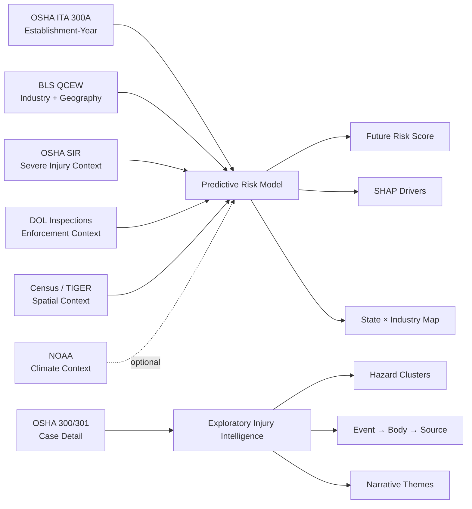
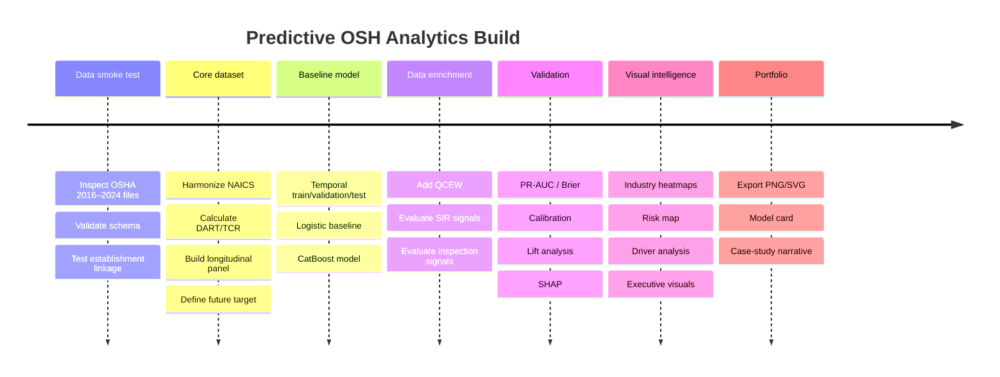

# Predictive AI / Exploratory OSH Analytics — Real Government Data Research Pack

## Executive summary

Yes — this can become a **seriously strong portfolio project**, and the public U.S. government data ecosystem is unusually good for it.

My recommendation is **not** to build a generic “AI predicts workplace accidents” notebook. The strongest flagship would be:

> **Predictive Workplace Injury Risk Intelligence**  
> A multi-source machine-learning system that estimates which reporting establishments are at elevated risk of a high injury-rate outcome in the following year, then explains the drivers and visualizes the risk geographically and by industry.

The core dataset should be OSHA's **Injury Tracking Application Form 300A establishment-level data**, available annually from 2016 onward. OSHA's 2024 release alone contained about **370,000 establishment reports**. It contains employee counts, hours worked, deaths, days-away cases, restricted/transfer cases, injury/illness categories, NAICS, geography, and establishment identifiers. OSHA explicitly provides the formula needed to derive TCR and DART rates. citeturn16search0turn17view1turn18view3

This can then be enriched with BLS **QCEW** employment/wage/establishment statistics, OSHA severe-injury and inspection histories, Census geography/economic context, and optionally NOAA climate information. QCEW is particularly valuable because it covers **more than 95% of U.S. jobs** and publishes county/state/national statistics by industry. citeturn13search5turn13search0

For a separate exploratory layer, OSHA's new Form 300/301 case-level data are remarkable: OSHA reported more than **732,000 partial case-detail records for 2024**, with injury narratives, occupation, outcome, time of incident, days away/restricted, and machine-generated SOC and OIICS fields. citeturn16search0turn18view4

The UK has excellent official HSE and ONS data, but the openly published HSE datasets are more aggregate. For example, HSE publishes detailed XLSX tables by industry, region/local authority, accident kind, age/gender, injury nature, and injury site, while its 2024/25 headline statistics report **59,219 employer-reported non-fatal injuries** under RIDDOR. That makes the UK data excellent for benchmarking and exploratory analysis, but less attractive than OSHA for a high-granularity predictive model. citeturn20search1turn20search3

**Google Colab should be the execution environment.** Colab is a hosted Jupyter service built for Python/data science/ML and can provide GPU/TPU resources, although Google notes that free resources and limits are not guaranteed. citeturn24search5 Use an AI coding assistant or Cowork to help write/debug/review the notebook, but keep the actual reproducible pipeline in `.ipynb`. OpenAI currently describes Cowork as part of Microsoft 365 Copilot, oriented toward cross-functional productivity work rather than being a reproducible scientific-computing runtime. citeturn24search0

My recommended architecture is:

```text
OSHA ITA 2016–2024
        │
        ├── Establishment injury history
        ├── Industry / size / workforce
        └── Geography
                │
                ▼
        FEATURE ENGINEERING
                │
      ┌─────────┼───────────┐
      │         │           │
    QCEW      OSHA SIR    DOL Inspection
 employment   severe      enforcement
 / wages      injury       history
      │         │           │
      └─────────┼───────────┘
                │
                ▼
        TEMPORAL ML MODEL
                │
      ┌─────────┼────────────┐
      │         │            │
    RISK     EXPLANATION    MAP
   SCORE        SHAP        STATE /
                           INDUSTRY
```

The important wording for the portfolio is **“risk estimation”**, not “predicting who will get injured.” The underlying datasets are observational and reporting-based, and OSHA explicitly warns that ITA rates should not be used by themselves to label establishments as the “most dangerous” or “least dangerous.” citeturn17view1

## Recommended data stack

There are enough official sources to build a sophisticated project without touching Kaggle or synthetic data.

The U.S. federal sources below are public government data. A licensing nuance matters: U.S. government works created by federal employees in their official duties are generally not protected by U.S. copyright, but not everything appearing on a federal website is necessarily a U.S. government work, so file-specific notices and attribution should still be respected. citeturn12search1 UK HSE and ONS material is generally reusable under the **Open Government Licence**, subject to its conditions. citeturn12search2turn12search15

| Dataset | Official source | Licence / access | Key fields | Size / coverage | Method | Suitability |
|---|---|---|---|---|---|---:|
| **OSHA ITA 300A Summary** | [OSHA ITA](https://www.osha.gov/itadata) citeturn17view1turn18view3 | U.S. federal public data | establishment ID/name, EIN, state, ZIP, NAICS, employees, hours, deaths, DAFW, DJTR, recordable cases, injury/illness types | **370k reports in CY2024**; annual data from 2016 citeturn16search0 | ZIP/CSV | **5/5** |
| **OSHA ITA 300/301 Case Detail** | [OSHA ITA](https://www.osha.gov/itadata) citeturn17view1turn18view4 | U.S. federal public data; narratives privacy-redacted | incident date/time, outcome, days away/restricted, job, SOC, narratives, OIICS event/nature/body/source | **>732k partial records for CY2024**; case detail since 2023 citeturn16search0 | ZIP/CSV | **5/5** |
| **OSHA Severe Injury Reports** | [OSHA SIR](https://www.osha.gov/severe-injury-reports) citeturn17view0 | U.S. federal public data | date, establishment, address/city/state, NAICS, hospitalization/amputation/eye loss, narrative, OIICS | 2015–Nov 2025 currently downloadable; exact row count not displayed on landing page citeturn15search0 | ZIP/download | **5/5** |
| **DOL/OSHA Inspections** | [data.gov Inspection dataset](https://catalog.data.gov/dataset/dol-enforcement-data-inspection) citeturn17view2 | Public access; U.S. DOL | inspection ID/date/address/type/status plus associated enforcement data | Bulk catalog; row count not exposed on catalog page; refreshed daily citeturn15search11 | DOL data portal / bulk | **4/5** |
| **BLS QCEW** | [QCEW Open Data](https://www.bls.gov/cew/additional-resources/open-data/) citeturn13search1 | U.S. federal public data | FIPS, NAICS, establishments, employment, wages, weekly wage, ownership, location quotient | Covers **>95% of U.S. jobs**; detailed county/state/industry data citeturn13search5 | Direct CSV slices | **5/5** |
| **BLS SOII** | [SOII](https://www.bls.gov/iif/overview/soii-overview.htm) citeturn13search2 | U.S. federal public aggregate series | nonfatal counts/rates, industry, case characteristics, demographics | Approx. **200k employers annually**; public microdata are restricted citeturn13search2turn14search5 | API / flat files / tables | **4/5** |
| **NOAA GHCN-Daily** | [NOAA GHCNd](https://www.ncei.noaa.gov/products/land-based-station/global-historical-climatology-network-daily) citeturn22search0 | U.S. federal public climate data | station, lat/lon, TMAX, TMIN, precipitation, snow, quality flags | **>100k stations** in 180 countries/territories; daily updates citeturn22search0 | HTTPS / NCEI API | **4/5** |
| **HSE RIDDOR Tables** | [HSE statistics tables](https://www.hse.gov.uk/statistics/tables/) citeturn20search1 | **UK OGL** citeturn20search0 | fatal/nonfatal counts/rates, industry, region/L.A., age/gender, accident kind, injury nature/site | **59,219 nonfatal employee injuries in 2024/25**; 126 worker fatalities in 2025/26 citeturn20search3turn20search8 | XLSX | **3/5 predictive; 5/5 exploratory** |

A few additional sources should be treated as **enrichment/reference tables rather than primary targets**.

**Census ACS 5-Year** gives demographic and workforce context down to small geographies. The Census Bureau samples roughly **3.5 million addresses annually**, and the 2020–2024 five-year release can be obtained through the Census API or FTP. The 2024 API documentation notes variable changes and geography comparability issues; current Census API documentation also requires an API key for these queries. citeturn21search14turn21search5

Official source: [ACS 2024 5-Year API](https://www.census.gov/data/developers/data-sets/acs-5year/2024.html)

**Census TIGER/Line** provides the geographic boundaries needed for choropleths. It does not itself contain demographics, but supplies geographic entity codes that can be joined to Census data. The 2025 files represent legal boundaries as of January 1, 2025. citeturn21search0

Official source: [TIGER/Line Shapefiles](https://www.census.gov/geographies/mapping-files/time-series/geo/tiger-line-file.html)

**Census County Business Patterns** is an alternative to QCEW if you want detailed establishment counts, employment and payroll by county and 2–6 digit NAICS. The Census API documentation states that CBP covers most industries and supports state, county, metro and ZIP-level outputs. citeturn21search2

Official source: [County Business Patterns API](https://www.census.gov/data/developers/data-sets/cbp-zbp/cbp-api.html)

**NAICS** should be your common industry taxonomy. OSHA files can contain 2012, 2017 or 2022 NAICS codes, so harmonization is required before longitudinal analysis. OSHA documents that variation directly, while Census provides official 2012/2017/2022 reference files and concordances. citeturn18view3turn23search3

Official source: [U.S. Census NAICS](https://www.census.gov/naics/)

**SOC** provides occupation coding. The 2018 SOC standard contains 867 detailed occupations grouped into 23 major groups. citeturn23search1

Official source: [2018 SOC](https://www.bls.gov/soc/2018/)

**OIICS** is particularly valuable for injury analytics because it categorizes the **nature of injury, body part, event/exposure, source and secondary source**. BLS introduced a major OIICS series break beginning with reference year 2023, so older and newer BLS series should not simply be concatenated without harmonization. citeturn23search0turn23search7

Official source: [BLS OIICS Manual](https://www.bls.gov/iif/definitions/occupational-injuries-and-illnesses-classification-manual.htm)

**NIOSH NIOCCS** is useful if any uncoded job/industry narrative has to be standardized. Its free API can turn industry/occupation text into NAICS/SOC-style codes and return JSON/XML; OSHA itself uses NIOCCS in its ITA case-detail processing. citeturn23search5turn18view4

Official source: [NIOSH NIOCCS API](https://wwwn.cdc.gov/NIOCCS/default.html)

For UK context, **ONS sickness absence** can support an exploratory workforce-health module. Its 2025 dataset includes annual sickness-absence rates, days lost, country/region, sex/age, sector and employment type; ONS warns that methodological improvements introduced from January 2024 create extra volatility around 2023–2024 comparisons. citeturn19search0turn19search1

Official source: [ONS Sickness Absence Dataset](https://www.ons.gov.uk/employmentandlabourmarket/peopleinwork/employmentandemployeetypes/datasets/sicknessabsenceinthelabourmarket)

The dataset relationships are unusually good for a portfolio project:



## Dataset quality, bias, and preprocessing plan

The main reason this project can look sophisticated is that **the hard part is not calling `.fit()`**. The interesting work is making heterogeneous occupational-health datasets analytically compatible.

**OSHA ITA 300A** is the most important source, but it is not a random census of all American workplaces. Reporting requirements depend on establishment size and industry: OSHA requires 300A submissions from certain establishments with 250+ employees and from establishments with 20–249 employees in designated industries. OSHA therefore explicitly says that the dataset may not be generalizable to the whole worker population. It also says it does **not validate employer-reported employee or injury/illness counts**. citeturn17view1turn15search5

The notebook should therefore:

```text
standardize column names
→ harmonize NAICS vintage
→ validate hours worked > 0
→ validate employee counts
→ calculate TCR / DART
→ inspect impossible/extreme rates
→ deduplicate establishment-year submissions
→ inspect Change_reason / latest submissions
→ create a longitudinal establishment key
→ generate lagged-only features
```

OSHA defines incidence rate as:

\[
\text{Incidence Rate} =
\frac{\text{Cases}\times200{,}000}
{\text{Employee Hours Worked}}
\]

and defines DART using days-away plus job-transfer/restriction cases. citeturn17view1

So:

```python
df["dart_cases"] = (
    df["total_dafw_cases"].fillna(0)
    + df["total_djtr_cases"].fillna(0)
)

df["tcr_cases"] = (
    df["total_dafw_cases"].fillna(0)
    + df["total_djtr_cases"].fillna(0)
    + df["total_other_cases"].fillna(0)
)

valid_hours = df["total_hours_worked"] > 0

df.loc[valid_hours, "dart_rate"] = (
    200_000 * df.loc[valid_hours, "dart_cases"]
    / df.loc[valid_hours, "total_hours_worked"]
)

df.loc[valid_hours, "tcr_rate"] = (
    200_000 * df.loc[valid_hours, "tcr_cases"]
    / df.loc[valid_hours, "total_hours_worked"]
)
```

One especially important preprocessing check is **longitudinal identity**. OSHA describes `establishment_ID` as the identifier used to link 300A summary records with 300/301 case detail, but the public documentation does not explicitly promise that it will behave as a perfect permanent cross-year panel identifier. citeturn18view3turn18view4 Before modeling, the notebook should empirically test persistence of `establishment_ID`, EIN, establishment name, ZIP and address across years rather than simply assuming it.

A defensible fallback panel key would be constructed from standardized fields such as:

```text
EIN
+ normalized establishment name
+ ZIP
+ normalized address
```

with entity matching done conservatively.

**OSHA case-detail data** require additional care. Every row represents one injury/illness case, and fields include outcome, days away/restricted, job description, SOC, narratives and OIICS categories. OSHA's public narratives have undergone automated and some manual redaction of personally identifiable and sensitive medical information. OSHA also notes that NIOCCS-generated SOC assignments are not independently validated and can receive an unknown code when descriptions are insufficient. citeturn18view4

Therefore the case-detail pipeline should:

```text
keep OSHA-redacted narratives only
→ remove empty/very short narratives
→ never try to reconstruct redacted information
→ retain SOC_probability as a quality variable
→ mark unknown SOC separately
→ use OIICS at the level supplied by OSHA
→ aggregate before public presentation
```

OSHA's OIICS fields in ITA are machine-generated in collaboration with BLS and currently use non-terminal two-digit OIICS categories rather than the maximum four-digit detail. citeturn18view4 That is still excellent for broad hazard-pattern analysis, but the portfolio should describe them as **automatically assigned categories**, not ground-truth medical coding.

**Severe Injury Reports** are ideal for temporal/geographic exploration because they span January 2015 through November 2025 in the current downloadable file and contain descriptions plus OIICS-coded injury information. But they cover **Federal OSHA jurisdiction only**, exclude State Plan jurisdiction events, and exclude fatalities. citeturn15search0 Older OSHA documentation also warns that geocodes were generated from addresses by third-party services and vary in precision. citeturn15search3

This means:

> A missing SIR observation in a State Plan state is **not zero risk**.

Any SIR map must either mask non-covered jurisdictions or explicitly restrict the analysis to federal OSHA jurisdictions.

**DOL inspection data** are refreshed daily and contain OSHA inspection information, while related DOL accident datasets contain coded injury records and accident narratives. citeturn15search11turn15search1turn15search7 They are analytically attractive but should never be treated as a random sample of workplaces: inspections are themselves selected by enforcement programs, complaints, referrals, incidents, programmed inspections and other processes. Hence, inspection history is a **signal of enforcement interaction**, not an unbiased measurement of intrinsic risk.

**QCEW** solves a major denominator problem. It gives establishment counts, employment and wage information by geography and industry, with CSV slices directly accessible by URL. BLS provides fields such as `area_fips`, `industry_code`, `year`, annual establishment count and annual employment, and QCEW covers more than 95% of U.S. jobs. citeturn13search0turn13search5 Confidentiality suppression and NAICS revisions still need handling.

Recommended QCEW preprocessing:

```text
retain state/county FIPS
→ collapse NAICS to common 2- or 3-digit level
→ preserve disclosure flag
→ convert suppressed values to NA
→ derive employment growth
→ derive establishment growth
→ derive wage growth
→ lag all contextual predictors before predictive use
```

**BLS SOII** is better used as an external benchmark than as your training microdata. It samples roughly 200,000 employers each year and provides generalizable nonfatal injury estimates, but individual SOII microdata are restricted to approved research access. citeturn13search2turn14search5 Public SOII/CFOI series also contain classification breaks that must be respected. citeturn14search5turn23search7

**NOAA GHCN-Daily** can enrich the project with heat/exposure context. It contains data from more than 100,000 stations and includes daily TMAX, TMIN and precipitation, with regular quality-control processing. NOAA also warns that record length and station coverage vary, and that GHCN-Daily is not homogenized for all historical systematic instrumentation changes. citeturn22search0

I would therefore make NOAA enrichment **optional rather than required for Version 1**. Complexity should come from valid modeling, not from piling on variables merely because they exist.

## Three portfolio-grade project concepts

**Flagship recommendation — Predictive Workplace Injury Risk Intelligence**

This is the one I would actually build for the portfolio.

**Research question**

> Given what we knew about an establishment at the end of year *t*, can we estimate its probability of having an unusually high DART outcome in year *t+1*?

This turns the project into real forecasting rather than classifying something that already happened.

**Unit of analysis**

```text
establishment × year
```

**Primary source**

OSHA ITA Form 300A, 2016–2024. The dataset has enough longitudinal depth and hundreds of thousands of establishment submissions in recent years. citeturn17view1turn16search0

**Target**

I would avoid an arbitrary universal DART threshold because baseline risk differs drastically by industry.

Instead define an analytical target such as:

```text
HIGH_RISK_NEXT_YEAR = 1

if next year's DART rate
exceeds the current-year 75th-percentile
for its NAICS peer group
```

That must be clearly labelled as **our analytical risk definition, not an OSHA designation**.

An even stronger notebook can simultaneously estimate:

```text
classification:
P(high-risk next year)

regression:
expected next-year DART rate
```

**Features**

The initial establishment feature set can be entirely official:

```text
Current injury history
──────────────────────
DART rate
TCR rate
DAFW cases
DJTR cases
other cases
deaths
days away
restricted days

Injury composition
──────────────────
injuries
skin disorders
respiratory conditions
poisonings
hearing loss
other illnesses

Workforce
─────────
annual average employees
hours worked
establishment size
private / state / local government

Industry
────────
NAICS 2-digit
NAICS 3-digit
industry peer rates

Temporal history
────────────────
1-year lag
2-year rolling mean
3-year trend
rate volatility
previous zero-injury years

Location
────────
state
ZIP-derived geography

Economic context
────────────────
QCEW employment
QCEW establishments
average weekly wage
employment growth
establishment growth

Optional contextual signals
───────────────────────────
state-industry severe injury history
OSHA inspection intensity
climate / extreme heat indicators
```

OSHA's summary dictionary directly supports the establishment/injury/workforce feature families, while QCEW supports employment, establishments and wages at industry/geographic levels. citeturn18view3turn13search0

**Model architecture**

Do not jump immediately to a neural network.

For tabular mixed categorical/numeric data, I would implement:

```text
Baseline 1
Industry-only naive probability

Baseline 2
Regularized Logistic Regression

Model A
CatBoost Classifier

Model B
LightGBM / XGBoost

Final
calibrated best model
```

CatBoost is particularly attractive because establishment data contains categorical structure such as NAICS, state and establishment type.

The “AI” in the portfolio is then real **predictive machine learning**, not decorative generative AI.

**Temporal validation**

Absolutely no random 80/20 split.

A proper design would resemble:

```text
FEATURE YEAR      TARGET YEAR

2016 ───────────► 2017
2017 ───────────► 2018
2018 ───────────► 2019
2019 ───────────► 2020
2020 ───────────► 2021
2021 ───────────► 2022
          TRAIN

2022 ───────────► 2023
        VALIDATION

2023 ───────────► 2024
          FINAL TEST
```

This makes the question honest:

> **Could the model have predicted the future using only information available at the time?**

**Evaluation**

Accuracy should not be the hero metric because elevated-risk establishments may be a minority class.

Use:

| Purpose | Metric |
|---|---|
| Ranking discrimination | PR-AUC, ROC-AUC |
| Probability quality | Brier score |
| Operational ranking | Precision@Top-10%, Recall@Top-10% |
| Risk targeting | Lift@Top-10% |
| Calibration | calibration curve / Expected Calibration Error |
| Regression side-model | MAE, RMSE or Poisson deviance |

The portfolio-friendly result would be something like:

```text
Top 10% predicted-risk establishments
→ X× higher future high-DART prevalence than baseline
```

—but only after the model produces that result. Do not invent the lift in advance.

**Visual outputs**

This project can easily produce 10+ portfolio-quality visuals:

1. Historical U.S. DART-rate distribution.
2. Industry risk heatmap.
3. State × industry risk matrix.
4. Predicted-risk distribution.
5. ROC and precision-recall curve.
6. Calibration plot.
7. Risk-decile lift chart.
8. SHAP feature-impact plot.
9. SHAP dependence plots.
10. State choropleth of aggregated predicted risk.
11. Actual vs predicted risk by industry.
12. Multi-year risk trajectories.

This is a project where the *model*, *data engineering*, *validation*, *explainability* and *visualization* can all be independently shown in the portfolio.

**Feasibility: very high.**

The summary dataset is large enough to look serious but still suited to tabular processing in Colab if you read selected columns, convert intermediate files to Parquet, and avoid repeatedly loading all raw files into memory.

---

**Exploratory alternative — Anatomy of Workplace Harm**

This one would use the OSHA **case-detail** dataset instead of annual summaries.

The question becomes:

> What recurring combinations of work activity, injury mechanism, body part, source, occupation and industry emerge from hundreds of thousands of real injury narratives?

The 2024 public release contained more than 732,000 partial Forms 300/301 case records, and the case dictionary includes incident date/time, outcome, days away/restricted, occupation, narratives, SOC and machine-generated OIICS fields. citeturn16search0turn18view4

Pipeline:

```text
CASE NARRATIVES
      │
      ├── text cleaning
      ├── OIICS categories
      ├── SOC
      ├── NAICS
      └── severity
              │
              ▼
       PATTERN MINING
              │
    ┌─────────┼─────────┐
    │         │         │
  TOPICS    CLUSTERS   NETWORK
    │         │         │
    ▼         ▼         ▼
hazard    latent      injury
themes    profiles    pathways
```

Methods:

```text
TF-IDF
→ Truncated SVD
→ NMF topic extraction

or

Sentence embeddings
→ UMAP
→ HDBSCAN / MiniBatchKMeans
```

The second route looks more “AI”, but the first is substantially easier to reproduce at large scale.

The most visually valuable outputs would be:

```text
Event
   ↓
Source
   ↓
Nature
   ↓
Body Part
   ↓
Outcome
```

as a Sankey/alluvial chart, plus:

- NAICS × event heatmap,
- occupation × hazard heatmap,
- injury-cluster UMAP,
- top narrative terms by cluster,
- severity by cluster,
- time-of-day pattern,
- event-to-body-part network,
- industry “hazard fingerprints.”

There is no need to force a supervised prediction target here. **Exploratory intelligence is the product.**

---

**Exploratory alternative — U.S. Severe Injury & Enforcement Risk Atlas**

This project would combine:

```text
OSHA Severe Injury Reports
+
BLS QCEW denominators
+
DOL OSHA inspections
+
Census TIGER boundaries
+
optional NOAA climate
```

SIR contains severe work-related hospitalization, amputation and eye-loss reports from federal OSHA jurisdictions beginning in 2015; QCEW supplies workforce denominators; the DOL catalog supplies inspection histories; and TIGER supplies official geographic boundaries. citeturn15search0turn13search5turn15search11turn21search0

The analytical unit could be:

```text
state × NAICS2 × quarter
```

That level is intentionally robust. County-level analysis is possible later, but it increases geocoding, sparsity and disclosure/coverage complications.

Derived metrics:

\[
\text{Severe Injury Rate}
=
\frac{\text{Severe Injury Reports}}
{\text{Industry Employment}}
\times 100{,}000
\]

and:

\[
\text{Inspection Intensity}
=
\frac{\text{OSHA Inspections}}
{\text{Number of Establishments}}
\]

Then build:

```text
PCA / UMAP
+
KMeans / HDBSCAN
```

to discover state-industry risk archetypes such as:

```text
high injury / high inspection
high injury / low inspection
low injury / high inspection
low injury / low inspection
```

These are descriptive clusters, **not causal categories**.

The output could contain a very strong portfolio visual:

```text
                HIGH SEVERE-INJURY RATE
                         ▲
                         │
       HIGH RISK         │       HIGH RISK /
       LOW INSPECTION    │       HIGH SCRUTINY
                         │
 LOW INSPECTION ◄────────┼────────► HIGH INSPECTION
                         │
       LOW SIGNAL        │       HIGH SCRUTINY /
                         │       LOWER INJURY RATE
                         ▼
                 LOW INJURY RATE
```

Then create a U.S. map where every state-industry unit is assigned a cluster.

This option is visually spectacular, although less cleanly “predictive” than the establishment model.

For your portfolio, my ranking is:

| Project | Technical depth | Predictive credibility | Visual potential | One-shot reliability | Recommendation |
|---|---:|---:|---:|---:|---|
| **Future establishment risk** | 5/5 | **5/5** | 5/5 | 4.5/5 | **Build this** |
| Case/narrative intelligence | 5/5 | — | **5/5** | 4/5 | Excellent second module |
| Severe-injury risk atlas | 4.5/5 | 3/5 | **5/5** | 4/5 | Excellent map-focused alternative |

## Google Colab one-shot blueprint

A literal “one prompt → perfect notebook → Run All” is possible in principle, but the reliable version should have **one initial data smoke-test** because government download filenames and schemas can change. Once the source discovery code has been verified and URLs/schema expectations are pinned, the notebook can be completely reproducible.

That is much safer than manually hardcoding dozens of historical OSHA filenames.

The notebook should be deliberately defensive.

**Cell — environment**

```python
# Core data stack
!pip -q install \
    pandas pyarrow polars \
    scikit-learn catboost lightgbm shap \
    geopandas pyogrio mapclassify \
    plotly kaleido \
    beautifulsoup4 requests joblib

import os
import re
import io
import json
import math
import random
import hashlib
import zipfile
from pathlib import Path
from urllib.parse import urljoin

import numpy as np
import pandas as pd
import requests
from bs4 import BeautifulSoup

SEED = 42
random.seed(SEED)
np.random.seed(SEED)

BASE = Path("/content/osh_predictive_ai")
RAW = BASE / "raw"
PROCESSED = BASE / "processed"
FIGURES = BASE / "figures"
MODELS = BASE / "models"

for p in [RAW, PROCESSED, FIGURES, MODELS]:
    p.mkdir(parents=True, exist_ok=True)
```

**Cell — discover official OSHA files instead of guessing URLs**

```python
OSHA_ITA_PAGE = "https://www.osha.gov/itadata"

def discover_osha_ita_links():
    r = requests.get(
        OSHA_ITA_PAGE,
        timeout=60,
        headers={"User-Agent": "Mozilla/5.0 research-notebook"}
    )
    r.raise_for_status()

    soup = BeautifulSoup(r.text, "html.parser")

    records = []
    for a in soup.select("a[href]"):
        text = " ".join(a.get_text(" ", strip=True).split())
        href = urljoin(r.url, a["href"])

        if re.search(r"20\d{2} Summary Data", text, re.I):
            year = int(re.search(r"20\d{2}", text).group())
            records.append({
                "year": year,
                "type": "summary",
                "url": href
            })

        if re.search(r"20\d{2} Case Detail Data", text, re.I):
            year = int(re.search(r"20\d{2}", text).group())
            records.append({
                "year": year,
                "type": "case_detail",
                "url": href
            })

    return pd.DataFrame(records).drop_duplicates()

links = discover_osha_ita_links()
display(links.sort_values(["year", "type"]))
```

The historical ITA page currently exposes summary data back to 2016 and case-detail data beginning in 2023. citeturn17view1

**Cell — robust ZIP loader**

```python
def read_csv_or_zip(url: str) -> pd.DataFrame:
    r = requests.get(
        url,
        timeout=180,
        headers={"User-Agent": "Mozilla/5.0 research-notebook"}
    )
    r.raise_for_status()

    content_type = r.headers.get("content-type", "").lower()

    if url.lower().endswith(".zip") or "zip" in content_type:
        with zipfile.ZipFile(io.BytesIO(r.content)) as z:
            csv_files = [
                name for name in z.namelist()
                if name.lower().endswith(".csv")
            ]
            if not csv_files:
                raise ValueError(f"No CSV found inside {url}")

            # Prefer largest CSV if the archive contains documentation.
            info = sorted(
                [z.getinfo(name) for name in csv_files],
                key=lambda x: x.file_size,
                reverse=True
            )[0]

            with z.open(info.filename) as f:
                return pd.read_csv(f, low_memory=False)

    return pd.read_csv(io.BytesIO(r.content), low_memory=False)
```

**Cell — load annual summary files and cache as Parquet**

```python
summary_links = (
    links.query("type == 'summary' and 2016 <= year <= 2024")
         .sort_values("year")
)

frames = []

for row in summary_links.itertuples():
    cache = RAW / f"osha_ita_summary_{row.year}.parquet"

    if cache.exists():
        tmp = pd.read_parquet(cache)
    else:
        tmp = read_csv_or_zip(row.url)
        tmp.columns = (
            tmp.columns.str.strip()
                       .str.lower()
                       .str.replace(r"[^a-z0-9]+", "_", regex=True)
                       .str.strip("_")
        )
        tmp["year"] = row.year
        tmp.to_parquet(cache, index=False)

    frames.append(tmp)

ita = pd.concat(frames, ignore_index=True)

print(f"Rows loaded: {len(ita):,}")
print(f"Years: {ita['year'].min()}–{ita['year'].max()}")
```

**Cell — data audit**

Produce automatically:

```text
rows by year
missingness table
duplicate IDs
NAICS vintages
invalid hours
invalid employee counts
extreme rates
state coverage
size distribution
establishment_ID cross-year persistence
```

Code skeleton:

```python
audit = pd.DataFrame({
    "missing_pct": ita.isna().mean().mul(100),
    "n_unique": ita.nunique(dropna=True)
}).sort_values("missing_pct", ascending=False)

display(audit.head(40))
```

**Cell — feature engineering**

```python
for c in [
    "total_dafw_cases",
    "total_djtr_cases",
    "total_other_cases",
    "total_hours_worked",
    "annual_average_employees",
]:
    ita[c] = pd.to_numeric(ita[c], errors="coerce")

ita["dart_cases"] = (
    ita["total_dafw_cases"].fillna(0)
    + ita["total_djtr_cases"].fillna(0)
)

ita["tcr_cases"] = (
    ita["dart_cases"]
    + ita["total_other_cases"].fillna(0)
)

valid = ita["total_hours_worked"].gt(0)

ita["dart_rate"] = np.where(
    valid,
    ita["dart_cases"] * 200_000 / ita["total_hours_worked"],
    np.nan
)

ita["tcr_rate"] = np.where(
    valid,
    ita["tcr_cases"] * 200_000 / ita["total_hours_worked"],
    np.nan
)

ita["naics_code"] = (
    ita["naics_code"]
    .astype("string")
    .str.replace(r"\.0$", "", regex=True)
)

ita["naics2"] = ita["naics_code"].str[:2]
```

**Cell — construct historical features**

Examples:

```python
ita = ita.sort_values(["panel_id", "year"])

for col in ["dart_rate", "tcr_rate", "dart_cases", "tcr_cases"]:
    ita[f"{col}_lag1"] = ita.groupby("panel_id")[col].shift(1)

ita["dart_roll2"] = (
    ita.groupby("panel_id")["dart_rate"]
       .transform(lambda s: s.shift(1).rolling(2).mean())
)

ita["dart_roll3"] = (
    ita.groupby("panel_id")["dart_rate"]
       .transform(lambda s: s.shift(1).rolling(3).mean())
)
```

Anything labelled `lag`, `rolling`, `industry benchmark` or `inspection history` must use data available **before the prediction target period**.

**Cell — QCEW enrichment**

BLS directly documents a CSV-slice URL structure that can be queried by year, quarter, industry or area. citeturn13search0

The production notebook should fetch only the industry/geographic levels we need rather than the whole QCEW universe.

Derived contextual variables:

```text
industry employment
industry establishments
average weekly wages
YoY employment growth
YoY establishment growth
wage growth
location quotient
```

**Cell — build future target**

Conceptually:

```python
future = ita[
    ["panel_id", "year", "dart_rate"]
].copy()

future["year"] -= 1
future = future.rename(
    columns={"dart_rate": "next_year_dart_rate"}
)

model_df = ita.merge(
    future,
    on=["panel_id", "year"],
    how="inner"
)
```

Then compute current-year peer threshold:

```python
peer_q75 = (
    model_df.groupby(["year", "naics2"])["dart_rate"]
            .transform(lambda s: s.quantile(0.75))
)

model_df["high_risk_next_year"] = (
    model_df["next_year_dart_rate"] > peer_q75
).astype("int8")
```

Again, this is an **analytical label created for the project**, not an OSHA risk category.

**Cell — temporal split**

```python
train = model_df[model_df["year"] <= 2021].copy()
valid = model_df[model_df["year"] == 2022].copy()
test  = model_df[model_df["year"] == 2023].copy()

print(
    train.shape,
    valid.shape,
    test.shape
)
```

That makes the final holdout:

```text
2023 information
       ↓
predict
       ↓
2024 outcome
```

**Cell — baseline**

```python
from sklearn.compose import ColumnTransformer
from sklearn.pipeline import Pipeline
from sklearn.preprocessing import OneHotEncoder, StandardScaler
from sklearn.impute import SimpleImputer
from sklearn.linear_model import LogisticRegression

# Fit simple baseline before the boosted model.
```

**Cell — CatBoost**

```python
from catboost import CatBoostClassifier

model = CatBoostClassifier(
    iterations=1200,
    learning_rate=0.05,
    depth=8,
    loss_function="Logloss",
    eval_metric="AUC",
    random_seed=SEED,
    verbose=100,
    allow_writing_files=False
)

model.fit(
    X_train,
    y_train,
    cat_features=cat_features,
    eval_set=(X_valid, y_valid),
    early_stopping_rounds=100,
)
```

**Cell — evaluation**

```python
from sklearn.metrics import (
    roc_auc_score,
    average_precision_score,
    brier_score_loss,
    classification_report,
    precision_recall_curve,
    roc_curve,
)

p = model.predict_proba(X_test)[:, 1]

metrics = {
    "ROC_AUC": roc_auc_score(y_test, p),
    "PR_AUC": average_precision_score(y_test, p),
    "Brier": brier_score_loss(y_test, p),
}

metrics
```

Then calculate lift:

```python
results = pd.DataFrame({
    "actual": y_test.values,
    "risk": p
})

results["decile"] = pd.qcut(
    results["risk"],
    10,
    labels=False,
    duplicates="drop"
)

lift = (
    results.groupby("decile")
           .agg(
               observed_rate=("actual", "mean"),
               n=("actual", "size")
           )
           .reset_index()
)

lift["lift_vs_population"] = (
    lift["observed_rate"] / results["actual"].mean()
)
```

**Cell — explainability**

```python
import shap

explainer = shap.TreeExplainer(model)

sample_X = X_test.sample(
    min(20_000, len(X_test)),
    random_state=SEED
)

shap_values = explainer(sample_X)

shap.plots.beeswarm(
    shap_values,
    max_display=20,
    show=False
)
```

**Cell — spatial aggregation**

Never expose a “worst establishment” ranking.

Aggregate:

```python
map_df = (
    prediction_df.groupby("state", as_index=False)
    .agg(
        mean_predicted_risk=("predicted_risk", "mean"),
        establishments=("predicted_risk", "size"),
    )
)
```

Then join it to Census TIGER boundaries. TIGER provides official geographic codes designed to link geographic shapes to statistical data. citeturn21search0

**Cell — automatic figure export**

```python
import matplotlib.pyplot as plt

FIG_DPI = 220

def savefig(name):
    plt.savefig(
        FIGURES / f"{name}.png",
        dpi=FIG_DPI,
        bbox_inches="tight"
    )
    plt.savefig(
        FIGURES / f"{name}.svg",
        bbox_inches="tight"
    )
```

Every final chart should be exported both as:

```text
PNG — portfolio / carousel
SVG — editing / Figma / Illustrator
```

Also export:

```text
model_metrics.csv
risk_deciles.csv
feature_importance.csv
aggregated_state_risk.csv
aggregated_industry_risk.csv
model_card.md
```

The notebook should finish with a **visual report section**, not raw cells:

```text
EXECUTIVE RESULT
↓
DATA COVERAGE
↓
EDA
↓
MODEL PERFORMANCE
↓
CALIBRATION
↓
RISK LIFT
↓
EXPLAINABILITY
↓
GEOGRAPHIC PATTERN
↓
LIMITATIONS
```

A strong one-shot coding prompt for generating the complete notebook would be:

```text
You are a senior occupational epidemiologist, data engineer, machine-learning
scientist, and data-visualization specialist.

Build ONE complete, reproducible Google Colab notebook titled:

"Predictive Workplace Injury Risk Intelligence:
Forecasting Next-Year High-DART Risk from U.S. Government OSH Data"

The notebook must run top-to-bottom with "Run all" and produce publication/
portfolio-quality visual outputs.

==================================================
CORE RESEARCH QUESTION
==================================================

Using only information available at the end of year t, estimate the probability
that an OSHA-reporting establishment will experience an unusually high DART
outcome in year t+1.

This is a risk-estimation project, NOT a causal model, NOT an OSHA enforcement
tool, and NOT a system for labeling employers as "safe" or "dangerous."

==================================================
OFFICIAL DATA ONLY
==================================================

Primary:
1. OSHA Injury Tracking Application Form 300A Summary Data
   https://www.osha.gov/itadata
   Years: 2016–2024

Optional enrichment:
2. BLS QCEW
   https://www.bls.gov/cew/additional-resources/open-data/

3. OSHA Severe Injury Reports
   https://www.osha.gov/severe-injury-reports

4. DOL OSHA Inspection Data
   https://catalog.data.gov/dataset/dol-enforcement-data-inspection

5. U.S. Census TIGER/Line
   https://www.census.gov/geographies/mapping-files/time-series/geo/tiger-line-file.html

Do not use Kaggle, synthetic datasets, or unofficial mirrors.

==================================================
DOWNLOAD DESIGN
==================================================

Do not blindly hard-code historical OSHA file names.

Scrape/discover download links from the official OSHA ITA landing page using
requests + BeautifulSoup.

Implement:
- retry logic
- HTTP status checking
- caching
- ZIP detection
- automatic CSV extraction
- schema validation
- meaningful failure messages

Cache cleaned yearly data as Parquet.

Print a complete provenance table:
dataset
URL
download timestamp
reference year
row count
column count

==================================================
DATA AUDIT
==================================================

Before analysis, report:

- rows by year
- duplicate records
- missingness
- NAICS versions
- state coverage
- establishment-size distribution
- employee count distribution
- hours-worked distribution
- impossible or zero denominators
- injury-count anomalies
- DART/TCR outliers
- establishment_ID cross-year persistence

Do NOT assume establishment_ID is a stable multi-year identifier until tested.

If necessary, construct a conservative fallback panel ID using normalized:
EIN + establishment name + ZIP/address.

Report the match quality.

==================================================
RATE ENGINEERING
==================================================

Use OSHA incidence-rate methodology:

DART cases =
days-away cases + job-transfer/restriction cases

DART rate =
DART cases * 200000 / employee hours worked

TCR cases =
DAFW + DJTR + other recordable cases

TCR rate =
TCR cases * 200000 / employee hours worked

Do not compute rates where hours <= 0.

Retain raw and transformed versions.

==================================================
INDUSTRY HARMONIZATION
==================================================

OSHA records may use different NAICS vintages.

Create:
- NAICS2
- NAICS3

Where practical harmonize to a common broad NAICS classification.

Document any limitations caused by 2012/2017/2022 NAICS changes.

==================================================
PREDICTIVE UNIT
==================================================

Unit:
establishment-year

Prediction:
features from year t
→ outcome in year t+1

Build panel pairs only where the establishment can be defensibly linked across
successive years.

==================================================
TARGET
==================================================

Primary target:

high_risk_next_year

Define it transparently as whether next-year DART exceeds a peer-based threshold
derived from information available in the prediction year.

Use a NAICS2 peer-group 75th percentile as the initial analytical threshold.

Clearly state this is a research label created for this project and is NOT an
OSHA designation.

Also retain continuous next_year_DART_rate for secondary regression analysis.

==================================================
FEATURES
==================================================

Use only features known before the target year.

Candidate features:

- DART rate
- TCR rate
- total DAFW cases
- total DJTR cases
- other recordable cases
- deaths
- days away
- restricted/transfer days
- total injuries
- respiratory conditions
- skin disorders
- poisonings
- hearing loss
- other illnesses
- annual average employees
- total hours
- establishment size
- establishment type
- NAICS2 / NAICS3
- state
- previous-year zero injury status

Create historical features:
- lag 1
- lag 2 when possible
- rolling mean
- rolling standard deviation
- trend/slope
- previous zero-injury streak
- changes in employment
- changes in hours
- changes in DART/TCR

Optional QCEW features:
- industry employment
- number of establishments
- average weekly wage
- employment growth
- establishment growth
- wage growth

All external context features must also be lagged so that future information
cannot leak into training.

==================================================
LEAKAGE CONTROL
==================================================

Explicitly audit leakage.

Do NOT:
- randomly split establishment-years
- fit preprocessing on the full dataset
- use future injury variables
- use target-year QCEW features if unavailable at prediction time
- use case-detail variables from the target year

All preprocessing objects must be fitted on training data only.

==================================================
TEMPORAL VALIDATION
==================================================

Use time-based evaluation.

Suggested:

TRAIN:
feature years <= 2021

VALIDATION:
2022 → predict 2023

FINAL TEST:
2023 → predict 2024

Never optimize based on the final 2024 test results.

Also report results by:
- industry
- establishment size
- state where sample size is adequate

==================================================
MODELS
==================================================

Train:

1. Naive industry baseline
2. Regularized Logistic Regression
3. CatBoost
4. LightGBM if computationally feasible

Use early stopping.

Do not use deep learning unless a clear analytical reason appears.

Select final model using validation data only.

Calibrate probabilities if necessary using isotonic or sigmoid calibration.

==================================================
METRICS
==================================================

Report:

- ROC-AUC
- PR-AUC
- Brier score
- precision
- recall
- F1
- Precision@top 5%
- Precision@top 10%
- Recall@top 10%
- Lift@top 5%
- Lift@top 10%

Produce a calibration curve.

For continuous DART prediction also report:
- MAE
- median AE
- RMSE or suitable count/rate deviance

==================================================
EXPLAINABILITY
==================================================

Use SHAP for the final tree-based model.

Produce:
- global SHAP beeswarm
- mean absolute SHAP importance
- selected dependence plots
- aggregated industry driver analysis

Never publish named establishment-level explanations.

==================================================
VISUALIZATION
==================================================

Create professional figures with clear titles, subtitles, source notes, and units.

Required visuals:

1. yearly dataset coverage
2. national DART distribution
3. DART trend over time
4. NAICS2 risk heatmap
5. establishment-size risk comparison
6. ROC curve
7. precision-recall curve
8. calibration curve
9. risk-decile lift chart
10. SHAP beeswarm
11. SHAP importance chart
12. predicted vs observed risk by industry
13. state × industry predicted-risk heatmap
14. U.S. choropleth of aggregated model risk
15. final executive "risk intelligence" summary chart

Use matplotlib/plotly/geopandas.

Never use establishment names in final rankings or maps.

==================================================
EXPORT
==================================================

Create:

/content/osh_predictive_ai/figures
/content/osh_predictive_ai/tables
/content/osh_predictive_ai/models

Export every final figure to:
- PNG at >=220 dpi
- SVG where supported

Export:
- metrics.csv
- data_audit.csv
- risk_deciles.csv
- feature_importance.csv
- state_summary.csv
- industry_summary.csv
- data_provenance.csv

Save final model and preprocessing objects.

Create a model_card.md containing:
- research question
- datasets
- training period
- target definition
- validation design
- performance
- known limitations
- prohibited interpretations
- ethical considerations

==================================================
ETHICS
==================================================

Explicitly state:

- OSHA ITA covers selected industries/sizes and is not representative of every
  U.S. workplace.
- Employer-reported counts can contain errors.
- High observed or predicted rates do not prove employer negligence.
- The model estimates statistical risk, not causation.
- Do not rank or publicly shame named establishments.
- Do not use the model for employment decisions.
- Do not interpret missing Severe Injury Report data in State Plan states as
  zero risk.
- Avoid sensitive demographic variables in predictive features.
- Preserve OSHA's narrative redactions.

==================================================
CODE QUALITY
==================================================

Use:
- Python
- pandas or polars
- pyarrow
- scikit-learn
- CatBoost
- LightGBM
- SHAP
- geopandas
- matplotlib
- plotly
- requests
- BeautifulSoup
- joblib

Set random seed = 42.

Use reusable functions.

Every major stage must print validation checks.

The notebook must fail loudly and clearly rather than silently producing invalid
results.

At the end, print a concise executive summary generated solely from computed
results; never invent metrics or findings.

The notebook should look like a reproducible research artifact, not a collection
of disconnected code cells.
```

That is close to the prompt I would eventually use. Before running the full thing, I would only add the exact source-link handling after a quick 5-minute smoke test of the OSHA file downloads.

## Execution environment, compute, and research ethics

For this specific project, use:

> **AI assistant for thinking/coding → Google Colab for execution → Figma/portfolio for presentation.**

Not “Cowork instead of Colab.”

Google describes Colab as a hosted Jupyter notebook environment with no setup, intended specifically for data science and machine learning; notebooks are standard `.ipynb` files and can be stored in Drive. Colab may provide GPU/TPU compute, although resource availability and limits can fluctuate. citeturn24search5turn24search4

For the recommended tabular project, you probably **do not need a GPU at all**.

A good compute strategy is:

| Task | Resource |
|---|---|
| 300A ingestion / cleaning | CPU + 12–16 GB-ish RAM desirable |
| Parquet conversion | CPU |
| Feature engineering | CPU |
| Logistic baseline | CPU |
| CatBoost / LightGBM | CPU initially |
| SHAP 10k–20k sample | CPU adequate |
| GeoPandas maps | CPU |
| 700k narrative embeddings | GPU helpful |
| UMAP on hundreds of thousands of embeddings | sample / GPU / dimensionality reduction |

Because free Colab resource allocation is variable rather than guaranteed, design the pipeline to cache files and resume cleanly rather than assuming a specific RAM/GPU configuration. citeturn24search5

For case-level NLP, I would start with **TF-IDF + SVD/NMF**. Only after the main pipeline works should you add sentence transformers. The flashy model should never be the part that makes the notebook unreliable.

On “GPT Cowork”: the official OpenAI material I can verify currently describes **Cowork inside Microsoft 365 Copilot**, where GPT models support complex cross-functional productivity tasks across the Microsoft 365 environment. citeturn24search0 That can be valuable for drafting the research narrative, reviewing tables or converting findings into a presentation, but it is not a substitute for a notebook runtime whose source code, environment and outputs can be rerun.

So my recommendation is:

```text
RESEARCH / ARCHITECTURE
ChatGPT / coding agent
        ↓
IMPLEMENTATION
Google Colab
        ↓
REPRODUCIBLE ARTIFACT
.ipynb + CSV + PNG + SVG
        ↓
INTERPRETATION
ChatGPT / Cowork
        ↓
PORTFOLIO
Figma / carousel
```

The ethics section should be treated as part of the technical work, not a footnote.

OSHA itself warns that ITA data come only from establishments subject to specific electronic-reporting rules and that the data are not necessarily representative of the overall worker population. It also explicitly warns against inferring that the workplaces with highest or lowest rates are automatically the “most dangerous” or “least dangerous.” citeturn17view1

That means your final product should **never** contain:

```text
“Top 10 most dangerous companies in America”
```

Instead:

```text
“Industry-adjusted predicted risk distribution”

“Aggregated state-level risk signal”

“Establishment-level predictions were used for model evaluation;
public reporting is aggregated.”
```

For public case narratives, OSHA has already applied automated and manual privacy redaction, but the notebook should still avoid displaying rare full narratives that might inadvertently provide identifiable context. citeturn18view4

For ACS enrichment, I would also deliberately **exclude race, ethnicity, sex and similar protected-demographic variables from the predictive model**. They could be useful for separate equity research, but they are not necessary to prove predictive OSH capability and create avoidable fairness/interpretation problems.

Finally, keep the distinction:

```text
PREDICTION ≠ CAUSATION
```

A high SHAP value for prior DART, employment growth or industry does not mean that variable “causes” injuries. It means the trained model found it useful for predicting the defined outcome under the observed data-generating process.

## Prioritized next steps and project timeline

The fastest path is **not** downloading everything immediately. First establish that the core longitudinal OSHA panel works. If that works, everything else becomes enrichment.

**Priority checklist**

1. **Download only OSHA ITA 300A for 2016–2024.** Confirm annual row counts, schema drift, NAICS vintages and cross-year `establishment_ID` persistence. OSHA's official page already provides the required historical files and data dictionary. citeturn17view1turn18view3
2. **Build the longitudinal panel and future target.** This is the go/no-go point. If establishment linkage is strong, proceed with the establishment model; if not, pivot the predictive unit to state × NAICS × year/quarter.
3. **Train the OSHA-only baseline.** Logistic regression + CatBoost; temporal 2024 holdout.
4. **Only then add QCEW.** It is the highest-value external enrichment because its industry/geography employment and wage structure is highly compatible with OSHA NAICS data. citeturn13search0turn13search5
5. **Add SIR / inspections only if they demonstrably improve validation performance or story depth.** Complexity should earn its place.
6. **Generate the visual pack.** Model performance, calibration, lift, SHAP, industry heatmap and map.
7. **Add case-level narrative exploration as a bonus analytical layer** using 2023–2024 ITA case data if the flagship model is already complete.
8. **Freeze data versions and export a model card.** The portfolio needs reproducibility more than another fancy algorithm.

A sensible build sequence is:



The key design choice I'd lock now is this:

# **Predictive Workplace Injury Risk Intelligence**

**Question:**  
*Can historical establishment, industry and contextual safety signals identify elevated next-year injury risk?*

**Core:**  
`OSHA ITA 2016–2024 → temporal ML → future risk score`

**Enrichment:**  
`BLS QCEW + OSHA SIR + OSHA enforcement + Census geography`

**Explainability:**  
`SHAP + calibration + risk-decile lift`

**Visual outputs:**  
`risk map + industry heatmap + model diagnostics + risk drivers`

**Public-facing rule:**  
`no named-employer ranking`

That is complex enough to look like a genuine applied data-science project, but still bounded enough that we can make the entire thing a **single reproducible Google Colab notebook with one Run All** once the OSHA download/linkage smoke-test is complete.