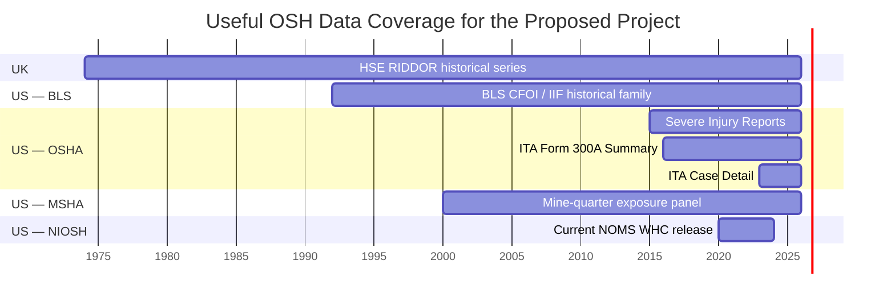

# Authoritative Public OSH Datasets for a Predictive AI / Exploratory Analytics Project

## Executive summary

For a portfolio project that needs to look **genuinely complex, technically defensible, visually rich, and still runnable in Google Colab**, the strongest public-government data are concentrated on the U.S. side rather than the UK side. OSHA now publishes establishment-level annual injury summaries from 2016 onward and case-level data from 2023 onward; the 2023 and 2024 case-detail releases alone contain about **1.57 million reported cases**. OSHA also publishes standardized OIICS classifications and redacted narratives. citeturn26view0turn15view0turn16view2

An even stronger **true forecasting** architecture is possible with the Mine Safety and Health Administration. MSHA publishes compatible tables for accidents, mine characteristics, and quarterly employment/production. Its documentation explicitly defines `MINE_ID` as a join key and provides quarterly employee counts and hours worked beginning in 2000. That makes it possible to build a mine-quarter panel in which historical exposure and accident information predict a future-quarter injury outcome—a much cleaner predictive design than trying to “predict” severity from a narrative written after an accident. citeturn23view0turn23view1turn23view2

My ranking for the eventual portfolio project is therefore:

| Rank | Candidate | Why it is strong |
|---|---|---|
| **Best overall** | **MSHA longitudinal mine-risk model** | Genuine future prediction, stable mine key, exposure hours, multiple tables, temporal modeling, explainability, mapping |
| **Best large-scale OSHA project** | **OSHA ITA establishment-year forecasting** | Multi-year establishment data; potentially millions of establishment-year rows; natural next-year risk target |
| **Best “big AI/data” visual project** | **OSHA ITA Case Detail** | ~1.57M cases in 2023–24 alone, narratives, occupation coding, OIICS, rich NLP/explainability possibilities |

The important distinction is that **OSHA Case Detail is the largest and flashiest dataset, but MSHA and OSHA Summary are better for a defensible “predictive risk” claim**. Case-detail records are created after an event has occurred; many fields therefore contain information that would not exist before the incident or before its severity was known. OSHA’s own dictionary contains outcome, days-away, injury narratives, date of death, and OIICS fields, all of which can become leakage if used to claim prospective risk prediction. citeturn14view3turn26view0

The UK Health and Safety Executive has excellent official statistical data, including RIDDOR, Labour Force Survey, occupational disease, regional and industry tables, with historical RIDDOR series going back to 1974. But the open releases are primarily **aggregated Excel statistical tables**, not million-row public incident-level microdata. They are therefore more useful as an external benchmark, time-series project, or supporting comparison than as the core of the large predictive-ML portfolio project you described. citeturn26view1turn25search17

**My recommendation:** build the main project with **MSHA**, use OSHA/BLS as context if desired, and create an analysis that goes:

> **Mine characteristics + exposure + historical safety performance → next-quarter injury risk → calibration → SHAP → risk segmentation → geographic/industry decision support**

That can be complex enough to look like a serious applied data-science project while still being designed as a single reproducible Colab notebook.

## Comparative dataset inventory

The priority score below is specifically for **your intended portfolio project**, not an assessment of the dataset's institutional quality. All of these are authoritative government sources; the score reflects how useful each is for a reproducible predictive OSH notebook.

| Dataset | Agency | Approx. records / scale | Coverage | Unit of observation | Strong candidate targets | Priority |
|---|---|---:|---|---|---|---:|
| **ITA Form 300A Summary** | OSHA | **778,223 submissions in 2023–24 alone**; larger multi-year corpus | 2016–2025 | Establishment-year | next-year high DART/TCR; next-year DAFW occurrence; worsening rate | **5/5** |
| **ITA Case Detail Forms 300/301** | OSHA | **1,571,947 cases in 2023–24** before later revisions | 2023–2025 | Recorded injury/illness case | severity class; DAFW; OIICS event; NLP classification | **4/5** |
| **Accidents + Mines + Quarterly Employment/Production** | MSHA | Agency does not publish one consolidated row count; multi-table, multi-decade | practical panel 2000–2025 | Accident; mine; mine-subunit-quarter | next-quarter NFDL/fatal injury; injury count; high-rate quarter | **5/5** |
| **Severe Injury Reports** | OSHA | Lower than ITA; exact current total not stated on landing page | 2015–present | Severe reported incident | severe-event subtype; clustering; industry/geographic patterns | **3/5** |
| **IIF / SOII / CFOI public series** | BLS | Many statistical series/cells; not public incident microdata | long historical series; CFOI family back to 1992 | Industry/geography/time statistical estimate | future incidence rate; fatality trend; rate anomaly | **3/5** |
| **RIDDOR + LFS statistical tables** | HSE UK | Aggregated tables; not a large public incident microdataset | RIDDOR history from 1974 | Industry/region/year/accident-class aggregate | rate/count forecasting; trend shifts | **2/5** |
| **Worker Health Charts / NOMS** | NIOSH/CDC | Aggregated/query-based surveillance output; underlying systems much larger | current NOMS charts include 2020–2023 | occupation/industry/cause demographic cells | elevated PMR/rate; surveillance pattern discovery | **2/5** |

The 2024 OSHA report states that **392,735 establishments** submitted Form 300A summaries covering **1,478,310 recorded injury/illness cases**, while **688,575 case-detail incident reports** were submitted. For 2023, OSHA reported **385,488** 300A establishments and **883,372** case-detail records. That yields **778,223 establishment-year submissions and 1,571,947 case-detail records for those two years alone**, before adding 2025 or the earlier summary years. citeturn15view0turn16view2

### OSHA ITA Form 300A Summary

This is arguably the cleanest OSHA source for **future establishment-risk prediction**. OSHA has collected annual Form 300A summary data through the Injury Tracking Application since 2016. Reporting is limited by establishment size and industry eligibility, so it is not a census of every U.S. workplace. citeturn26view0

**Official sources**

```text
Main data portal
https://www.osha.gov/itadata

2024 Summary ZIP
https://www.osha.gov/sites/default/files/ITA_300A_Summary_Data_2024_through_12-31-2025.zip

Summary data dictionary
https://www.osha.gov/sites/default/files/ITA_Data_Dictionary.pdf
```

No API key or authentication is required for the public OSHA download page. OSHA currently also exposes 2025 summary data from its ITA page. citeturn26view0

**Schema**

The summary dictionary includes establishment identifiers and descriptive fields such as establishment/company name, EIN, address, state, ZIP, NAICS, industry description, and size category. It also contains annual average employees, total hours worked, deaths, DAFW cases, DJTR cases, other recordable cases, days away, restricted/transfer days, injury and illness categories, and an `establishment_ID`. citeturn14view2

Typical types are:

```text
establishment_ID             integer / identifier
EIN                          string
state                        categorical
zip                          string
NAICS                        integer/string code
size                         categorical
annual_average_employees     numeric
total_hours_worked           numeric
total_deaths                 numeric
total_dafw_cases             numeric
total_djtr_cases             numeric
total_other_cases            numeric
total_dafw_days              numeric
total_djtr_days              numeric
created_timestamp            datetime
```

OSHA defines the incidence-rate formula as:

```text
cases × 200,000
────────────────
 hours worked
```

and defines DART using deaths? More precisely, OSHA's ITA page states that the DART rate uses cases in Form 300 columns H + I, while TCR covers H + I + J. citeturn26view0

**Best predictive targets**

| Target | Prediction design | Leakage risk |
|---|---|---|
| **Next-year high DART rate** | Use establishment history through year `t`; predict top-risk group at `t+1` | **Low** if future-year fields are completely excluded |
| **Any DAFW case next year** | Binary establishment-year classification | **Low** |
| **Next-year TCR above industry percentile** | Peer-adjusted classification | **Low–moderate**; calculate percentile using training/historical data only |
| **Year-over-year safety deterioration** | Predict whether DART/TCR increases materially | **Low** |
| **Persistent high-risk establishment** | Predict repeated high-rate status | **Moderate** because entity persistence and regression-to-mean require care |

The most important preprocessing task is creating a **longitudinal establishment panel**. OSHA documents `establishment_id` for linking Summary to Case Detail, but the notebook should empirically test how reliably identifiers persist across years before assuming that every establishment can simply be followed longitudinally. citeturn26view0

I would create features such as:

```text
lag_1_tcr
lag_1_dart
lag_1_dafw_rate
lag_2_tcr
rolling_2yr_tcr_mean
rolling_3yr_tcr_sd
year_over_year_rate_change
employee_count
hours_worked
hours_per_employee
establishment_size
NAICS
state
industry_peer_rate
previous_zero_case_flag
previous_dafw_flag
```

All rate features should be lagged. Using the same year's injury totals to “predict” the same year's DART rate would simply encode the target.

A major quality caveat is explicit in OSHA's documentation: OSHA says unresolved reporting errors remain, it **does not validate the employee or injury/illness counts submitted by establishments**, and the ITA population is not representative of the entire U.S. workforce. OSHA specifically warns against ranking establishments as “most dangerous” simply from the highest calculated rates. citeturn26view0

### OSHA ITA Case Detail

This is the best dataset for **large-scale exploratory analytics, NLP, injury taxonomy analysis, and explainable classification**.

```text
Main portal
https://www.osha.gov/itadata

2024 Case Detail ZIP
https://www.osha.gov/sites/default/files/ITA_Case_Detail_Data_2024_through_12-31-2025.zip

Case-detail dictionary
https://www.osha.gov/sites/default/files/case_detail_data_dictionary.pdf
```

OSHA's annual reports show **883,372 case-detail records in 2023** and **688,575 in 2024**, or approximately **1.572 million records across those two releases**. citeturn16view2turn15view0

Each row represents a **single work-related recorded injury or illness**. OSHA's dictionary includes `establishment_ID`, establishment characteristics, NAICS, size, annual employee count, hours worked, case number, incident date, outcome, days away, days transferred/restricted, injury/illness type, job description, SOC coding, and multiple redacted narrative fields. citeturn14view3

Particularly interesting fields include:

```text
establishment_ID
NAICS
size
annual_average_employees
total_hours_worked

case_number
date_of_incident
incident_outcome
dafw_num_away
djtr_num_tr
type_of_incident

job_description
SOC_code
SOC_description

New_nar_before_incident
New_nar_what_happened
New_nar_injury_illness
New_nar_object_substance

OIICS Nature
OIICS Part of Body
OIICS Event / Exposure
OIICS Source
OIICS Secondary Source
```

OSHA reports that the occupational coding uses NIOSH's NIOCCS system, while the newer OIICS fields were generated with a BLS-developed AI-assisted auto-coder. OSHA also says the narrative fields are processed using automated and manual review to remove personally identifiable and sensitive medical information. citeturn14view3turn26view0

The native join is:

```text
Case Detail.establishment_ID
          ↓
Summary.establishment_ID
```

OSHA explicitly documents this linkage. It also warns that many establishments that submit Summary data are not required to submit Case Detail, and establishments with zero recordable cases have no case-detail row. citeturn26view0

**Possible targets**

| Target | Analytical usefulness | Leakage risk |
|---|---|---|
| `incident_outcome` — DAFW/DJTR/other/death | Severity classification | **High unless outcome-derived fields and post-event descriptions are excluded** |
| DAFW vs non-DAFW | Severity classification | **Moderate–high** |
| OIICS event/exposure category | NLP auto-classification | **Low leakage conceptually** if raw narrative is the intended input; but this is classification, not prospective risk |
| OIICS injury/source category | Injury-taxonomy NLP | **Low** for classification |
| Days-away severity band | Severity regression/classification | **Very high** if injury description/outcome fields are included |

This dataset can produce spectacular visuals—text clusters, Sankey relationships between event/source/body part/outcome, industry heat maps, temporal patterns, occupation-risk matrices, SHAP plots, and local explanations—but I would **not headline it as “predicting accidents before they happen.”**

A more honest headline would be:

> **Can machine learning identify which reported injury cases are likely to become more severe using only information available at a defined case-intake point?**

Even then, the prediction moment must be explicitly defined because all public records ultimately originate from post-event reporting.

### MSHA integrated mine-safety data

This is, in my judgment, the **best dataset ecosystem for the portfolio**.

MSHA publishes compatible accident, mine, and employment/production structures. Its accident dictionary explicitly states that `MINE_ID` joins accident records to Mines and other tables. The Mine table defines `MINE_ID` as its unique primary key. citeturn23view0turn23view1

**Current official portal**

```text
https://www.msha.gov/data-and-reports/mine-data-retrieval-system
```

**Official dictionaries**

```text
Accidents
https://arlweb.msha.gov/OpenGovernmentData/DataSets/Accidents_Definition_File.txt

Mines
https://arlweb.msha.gov/OpenGovernmentData/DataSets/Mines_Definition_File.txt

Quarterly Employment / Production
https://arlweb.msha.gov/OpenGovernmentData/DataSets/MineSProdQuarterly_Definition_File.txt
```

**Official Data.gov catalog entry for quarterly employment/production**

```text
https://catalog.data.gov/dataset/msha-operator-employment-and-production-data-set-quarterly
```

The Data.gov catalog gives the current quarterly employment/production dataset a **2000–2025** temporal coverage. citeturn6view0

Legacy MSHA open-government bulk locations historically follow these paths and are worth probing at the beginning of the Colab notebook; the current Mine Data Retrieval System should remain the authoritative fallback if an older bulk endpoint has moved:

```text
https://arlweb.msha.gov/OpenGovernmentData/DataSets/Accidents.zip
https://arlweb.msha.gov/OpenGovernmentData/DataSets/Mines.zip
https://arlweb.msha.gov/OpenGovernmentData/DataSets/MineSProdQuarterly.zip
```

The quarterly exposure table contains:

```text
MINE_ID
MINE_NAME
STATE
SUBUNIT_CD
CAL_YR
CAL_QTR
AVG_EMPLOYEE_CNT
HOURS_WORKED
COAL_PRODUCTION
COAL_METAL_IND
```

and MSHA specifically states that employee count and hours worked are reported quarterly, with these fields available beginning in 2000. citeturn23view2

The Mine table adds unusually rich structural information:

```text
CURRENT_MINE_TYPE
CURRENT_MINE_STATUS
STATE / COUNTY
commodity / SIC
coal vs metal/non-metal
portable operation
days per week
hours per shift
production shifts per day
maintenance shifts per day
employee count
latitude / longitude
average mine height
methane liberation
highwall miner indicator
safety committee indicator
other mine characteristics
```

with documented missingness for fields that do not apply to every mine type. citeturn23view1

The accident file is equally rich:

```text
MINE_ID
ACCIDENT_DT
CAL_YR
CAL_QTR
ACCIDENT_TIME
DEGREE_INJURY
classification
accident type
number injured
total mining experience
mine experience
job experience
occupation
activity
injury source
nature of injury
body part
days restricted
days lost
return-to-work date
immediate-notification category
narrative
coal/metal indicator
```

MSHA explicitly categorizes fatal, nonfatal-days-lost, and no-days-lost outcomes, and defines injury incidence rates using **200,000 employee-hours as the denominator**. citeturn23view0turn24search29

That exposure denominator is an enormous analytical advantage.

A defensible modeling table would not use one accident row as one training row. Instead:

```text
ACCIDENTS
   │ aggregate historical cases
   │ by MINE_ID + quarter
   ▼
MINE-QUARTER PANEL
   ▲
   │ hours / workers / production
QUARTERLY EMPLOYMENT
   ▲
   │ mine characteristics
MINES
```

Then shift outcomes one quarter forward:

```text
FEATURES AT Q(t)
          ↓
PREDICT
          ↓
INJURY OUTCOME AT Q(t+1)
```

**Candidate targets**

| Target | Leakage risk | Comment |
|---|---|---|
| Any NFDL/fatal case next quarter | **Low** | My recommended primary target |
| Count of NFDL cases next quarter | **Low** | Poisson/negative-binomial or boosted count model |
| Any fatal/permanent-disability case next quarter | **Low**, but extreme imbalance | Great secondary analysis, probably not primary model |
| Next-quarter incidence rate above industry peer threshold | **Low–moderate** | Need minimum-hours rule to control unstable small denominators |
| Time to next reportable injury | **Low** | Excellent advanced survival-analysis extension |

The accident dictionary contains many fields that are perfectly valid for describing the *previous* accident but would be leakage if applied to the accident being predicted. The clean solution is to summarize those features historically—e.g. fraction of previous cases involving powered haulage, previous NFDL incidence, days since last injury—and use only data timestamped before the target quarter. citeturn23view0

This gives you something far more impressive than a generic classifier:

> **A longitudinal, exposure-adjusted mine safety early-risk model built from three government datasets.**

### OSHA Severe Injury Reports

Since January 2015, covered employers have had to report a work-related inpatient hospitalization, amputation, or loss of an eye within 24 hours after learning of the event. OSHA makes Severe Injury Report data publicly downloadable. citeturn26view0turn2view1

```text
https://www.osha.gov/severeinjury
```

The Severe Injury Report dataset covers **Federal OSHA jurisdiction**, not the complete State Plan universe. OSHA also cautions that geographic coordinates were generated through third-party geocoding and may vary in precision. citeturn2view1

Potential work includes:

```text
amputation vs hospitalization vs eye-loss classification
industry × geography severe-injury hotspot detection
temporal anomaly detection
event-type clustering
narrative/topic analysis where fields permit
```

The problem for a predictive portfolio is that the dataset is already conditioned on a **severe event having occurred**. Predicting “severe injury” from severe-injury reports is therefore conceptually circular.

I would use this as a **supporting exploratory dataset**, not the hero model.

### BLS Injuries, Illnesses, and Fatalities

The Bureau of Labor Statistics publishes Survey of Occupational Injuries and Illnesses and Census of Fatal Occupational Injuries outputs through interactive databases, flat files, and its public API. Current databases include industry injury/illness estimates and fatal injury profiles, while historical flat files extend several series substantially further back. citeturn2view3

```text
IIF data
https://www.bls.gov/iif/data.htm

API documentation
https://www.bls.gov/developers/home.htm

API endpoint
https://api.bls.gov/publicAPI/v2/timeseries/data/
```

BLS API v2 supports JSON/XLSX and GET/POST patterns. Version 2 requires a free registration key; BLS currently documents limits of **500 queries/day, 50 series/query and 20 years/query** for registered users, versus 25 queries/day, 25 series/query and 10 years/query without registration/version-1 access. citeturn19view0turn20view0

A typical Python request architecture is:

```python
payload = {
    "seriesid": ["YOUR_IIF_SERIES_ID"],
    "startyear": "2010",
    "endyear": "2025",
    "registrationkey": "YOUR_BLS_KEY"
}

POST https://api.bls.gov/publicAPI/v2/timeseries/data/
```

The weakness for your intended AI project is that public BLS occupational-injury data are largely **statistical estimates and series**, rather than downloadable case-level SOII/CFOI microdata.

The strength is that BLS provides a more representative national statistical framework than OSHA ITA. OSHA itself points users to BLS for generalizable occupational injury/illness counts and rates because ITA reporting applies only to specified industries and establishment sizes. citeturn26view0

So BLS could become an **enrichment layer**:

```text
OSHA establishment
       ↓ NAICS + year
BLS industry benchmark
       ↓
relative establishment performance
```

or an independent time-series project:

```text
industry injury-rate forecasting
fatality trend forecasting
structural break detection
rate anomaly detection
industry trend clustering
```

For your portfolio, I would use BLS as a **benchmark/external-context layer** rather than the primary model source.

### HSE RIDDOR and Labour Force Survey tables

HSE publishes accredited official statistics covering RIDDOR, LFS, occupational disease, occupational lung disease, costs, industrial injury benefit data, and other safety topics. Unless otherwise stated, its statistical tables represent Great Britain. citeturn26view1

```text
Master table index
https://www.hse.gov.uk/statistics/tables/index.htm

Historical RIDDOR workbook
https://www.hse.gov.uk/statistics/assets/docs/ridhist.xlsx

Detailed-industry RIDDOR workbook
https://www.hse.gov.uk/statistics/assets/docs/ridind.xlsx

Kind-of-accident RIDDOR workbook
https://www.hse.gov.uk/statistics/assets/docs/ridkind.xlsx
```

Those XLSX endpoints are live HSE spreadsheet resources. citeturn27view0turn27view1turn27view2

HSE's historical RIDDOR series covers fatal and nonfatal injuries from **1974 onward**, while current workbooks include views by detailed industry, region/local authority, age/gender, accident kind, injury nature and injury site. citeturn26view1

Possible forecasting targets include:

```text
next-year fatality count by industry
next-year nonfatal injury count
future incidence-rate trend
industry-year anomaly
region × industry risk trend
```

But because these public tables are aggregated, the effective sample size for machine learning is dramatically smaller than the million-row OSHA dataset.

A UK-only project could still be very good as **statistical time-series analytics**, but it would not give you the same “large-scale predictive AI” story.

### NIOSH Worker Health Charts and NOMS

NIOSH's Worker Health Charts integrate multiple worker-health surveillance sources and are specifically intended to facilitate exploration of occupational safety and health data. citeturn25search0turn25search8

```text
Worker Health Charts
https://wwwn.cdc.gov/niosh-whc/

NOMS
https://www.cdc.gov/niosh/surveillance/noms/index.html
```

The National Occupational Mortality Surveillance system adds industry and occupation information to mortality surveillance. NIOSH describes a workflow in which jurisdiction death certificates go to NCHS, occupation/industry narratives are coded with NIOCCS, and the coded data are returned to NCHS. Current Worker Health Charts expose NOMS cause-of-death outputs for **2020–2023**, including age-adjusted rates and proportionate mortality ratios. citeturn25search1turn25search9

NIOSH notes that from 2022 forward all 50 states, New York City and Washington, D.C. participate in the relevant occupational mortality coding flow. citeturn25search1

This is fascinating occupational epidemiology data, but the convenient public interface is geared toward surveillance/aggregate analysis rather than a ready-made million-row Colab classification table. I would keep it as a future project around **occupation × cause-of-death surveillance**, not use it for this first predictive portfolio project.

## Predictive design, schemas, and leakage

The major project-design decision is not which algorithm to use. It is **what moment in time the prediction represents**.

Consider the three strongest datasets.

| Project architecture | Prediction moment | Legitimate predictors | Target | Leakage risk |
|---|---|---|---|---|
| OSHA Summary | end of year `t` | data through `t` | establishment outcome in `t+1` | **Low** |
| MSHA panel | end of quarter `q` | data through `q` | mine injury in `q+1` | **Low** |
| OSHA Case Detail | after incident, before final outcome | limited incident/context fields | case severity | **Moderate/high** |

This is why I would favor **temporal forecasting** over a static case classifier.

A weak portfolio design would be:

```text
2024 accident record
├─ days lost
├─ injury type
├─ injury description
├─ body part
├─ final outcome
└─ MODEL → predict "severe injury"
```

The model can look extraordinarily accurate because it is reading the answer.

The stronger design is:

```text
HISTORICAL STATE AT TIME t

workers
hours worked
production
industry / mine type
previous injuries
previous rates
risk trend
time since prior injury
historical injury mix

                 ↓

        MODEL AT TIME t

                 ↓

      FUTURE OUTCOME t+1
```

For MSHA, an example engineering specification could be:

```text
UNIT OF ANALYSIS
Mine × calendar quarter

TARGET
Any NFDL or fatal injury in the following quarter

PREDICTION HORIZON
1 quarter

FEATURE WINDOW
Previous 1–8 quarters

PRIMARY IDENTIFIER
MINE_ID

TEMPORAL KEYS
CAL_YR + CAL_QTR
```

MSHA's official accident documentation describes the degree-of-injury field and the accident quarter/year fields, while its quarterly production table provides precisely the employee-hours denominator required to normalize exposure. citeturn23view0turn23view2

Example engineered features:

```text
EXPOSURE
lag_hours_worked
rolling_4q_hours
avg_employee_count
coal_production
production_per_hour

HISTORICAL SAFETY
injury_count_lag1
injury_count_rolling4
nfdl_count_rolling4
fatal_count_rolling8
incidence_rate_rolling4
quarters_since_last_injury

TREND
injury_rate_slope
hours_worked_change
production_change
employee_change

MINE CONTEXT
mine_type
coal_metal_ind
commodity
state
portable_operation
mine_status
safety_committee_indicator

HISTORICAL EVENT MIX
fraction_powered_haulage
fraction_machinery
fraction_falls
fraction_high_experience_cases
```

The event-mix variables would be created only from **previous quarters' accidents**.

A model suite could then genuinely justify complexity:

```text
BASELINE
Historical prevalence / naive risk

INTERPRETABLE
Logistic Regression

NONLINEAR
Random Forest

BOOSTED
LightGBM or XGBoost

OPTIONAL ADVANCED
Discrete-time survival model
```

Validation should be temporal:

```text
Train:       2000 ───────── 2019
Validation:                    2020 ─ 2022
Test:                                2023 ─ 2025
```

The precise years should be selected only after examining missingness and changes in data quality.

And the headline metrics should not be “accuracy.” A rare serious-injury target needs:

```text
PR-AUC
ROC-AUC
Recall / Sensitivity
Precision
Specificity
F1
Brier Score
Calibration curve
Recall at top X% risk
```

That last metric—**how many future injury quarters are captured if the HSE team can review only the top 5% or 10% highest-risk mines**—would make an excellent decision-support visualization.

## Coverage and scale visuals

The timeline below shows the useful coverage of the major public sources. The MSHA bar intentionally begins in 2000 because that is when its documented quarterly employee-count field begins, which makes 2000 the natural start point for an exposure-adjusted forecasting panel. citeturn23view2turn26view0turn26view1turn25search9



For record volume, these are the OSHA counts for which the agency publishes clear annual totals. The other candidate sources either do not publish a consolidated row count in their landing metadata or are statistical tables/series, making direct row-count comparisons misleading. citeturn15view0turn16view2

```text
Published row-level scale
(each █ ≈ 100,000 records)

OSHA Case Detail, 2023–24
1.572M  ████████████████

OSHA Summary, 2023–24
0.778M  ████████

OSHA Case Detail, 2024 only
0.689M  ███████

OSHA Summary, 2024 only
0.393M  ████


MSHA integrated tables
        [exact consolidated row count not published;
         calculate immediately after ingestion]

BLS IIF
        [statistical series / table cells, not incident rows]

HSE RIDDOR
        [aggregate workbook tables]

NIOSH WHC / NOMS
        [query / aggregate surveillance outputs]
```

The OSHA 2024 report also gives a sense of the underlying event volume: the 392,735 Form 300A establishments reported approximately **1.48 million injury and illness cases**, while the Case Detail file represented 688,575 individual incident reports. citeturn15view0

So yes: **we absolutely can build this around hundreds of thousands or millions of real government records.**

For Colab, that scale is large enough to look substantive but still manageable if the notebook is engineered sensibly.

For example:

```text
RAW CSV / ZIP
      ↓
Polars or pandas chunked read
      ↓
schema optimization
      ↓
Parquet cache
      ↓
aggregation / feature engineering
      ↓
model-ready table
```

For the MSHA design, the raw accident table can be reduced to one row per mine-quarter before modeling. That prevents the model training table from becoming unnecessarily huge even if source event tables are large.

For OSHA Case Detail, 1.5M+ rows of structured data are workable, but fitting transformer NLP models over all narratives is a different computational class. A free/standard Colab-oriented one-shot workflow should prefer **TF-IDF / hashing + linear models**, CatBoost/LightGBM on structured features, or a carefully sampled embedding stage rather than attempting to fine-tune a large language model over the full corpus.

## Legal, licensing, and data-quality constraints

For U.S. federal government material, U.S. copyright law states that copyright protection is not available for a work of the U.S. Government, although separate rights can exist in third-party material. citeturn28view0 BLS is especially explicit: it says everything BLS publishes is in the public domain except previously copyrighted photographs and illustrations, and asks users to cite BLS as the source. citeturn19view1

For a portfolio, I would therefore preserve provenance on every chart:

```text
Source: U.S. Department of Labor,
Mine Safety and Health Administration (MSHA)

Retrieved: YYYY-MM-DD
Analysis: Angger Wicaksana
```

or:

```text
Source: OSHA Injury Tracking Application,
U.S. Department of Labor
```

Do not reuse federal agency logos in a way that implies endorsement. BLS, for example, specifically notes that its emblem is a federally registered trademark even though its published statistical material is public domain. citeturn19view1

The UK position is different. HSE material is **Crown copyright**, not technically “public domain.” HSE pages state that content is available under the **Open Government Licence v3.0 unless otherwise stated**. The OGL grants a worldwide, royalty-free, perpetual, non-exclusive right to use the information, subject principally to attribution and the other license conditions. citeturn25search7turn18search2

So for HSE:

```text
Contains public sector information published by HSE
and licensed under the Open Government Licence v3.0.
```

is a safer attribution pattern than calling it “public domain.”

Beyond licensing, the important constraints are analytical.

**OSHA ITA representativeness.** OSHA's electronic reporting population is selected by industry and establishment size; OSHA says the data therefore may not generalize to all workers. citeturn26view0

**OSHA data quality.** OSHA performs quality checks but does not validate every employer-reported employee count, injury count, or underlying rate component; some errors remain. citeturn26view0

**Reporting is not blame.** OSHA explicitly states that recording an injury or illness does not establish employer fault, worker fault, regulatory violation, or workers' compensation eligibility. citeturn26view0

**MSHA structural missingness.** Its data dictionary marks many mine-characteristic fields as nullable or applicable only to particular mining types—for example methane or mining-height variables. These should be modeled as domain-specific missingness, not blindly median-imputed. citeturn23view1

**Small-denominator rates.** Because both OSHA and MSHA normalize injury incidence by hours worked, very small exposure denominators can create unstable rates. MSHA's official statistics use the same 200,000-hour incidence-rate convention. citeturn24search29turn26view0

**HSE comparability.** HSE documents time-series caveats around Labour Force Survey changes and pandemic-era disruption; it specifically notes unusual comparability around 2019/20–2021/22. citeturn25search29

**Narrative privacy.** OSHA's public case narratives are redacted, but the notebook should still treat free-text records as sensitive occupational narratives and should never attempt worker re-identification. OSHA says both automated and manual processes are used for redaction. citeturn14view3

## Recommended project choices

### The strongest choice: MSHA predictive mine-risk intelligence

**Working title**

> **Can Historical Mine Operations Signal Elevated Injury Risk Before the Next Quarter?**

Or portfolio version:

> **From Exposure to Early Warning — Predictive Safety Analytics Across U.S. Mines**

This is the project I would choose.

**Core data**

```text
MSHA Mines
+
MSHA Quarterly Employment / Production
+
MSHA Accidents
```

The tables share documented MSHA identifiers and provide mine characteristics, quarterly worker exposure, production, and accident outcomes. citeturn23view0turn23view1turn23view2

**Initial research question**

> Given information known through the end of a quarter, can historical operations, exposure, mine characteristics, and prior safety performance identify mines with elevated probability of an NFDL or fatal injury during the following quarter?

That is a **real future prediction**.

No fake AI story.

No post-outcome leakage required.

**Analytical architecture**

```text
                    MSHA MINES
                         │
                         │ MINE_ID
                         ▼
MSHA EMPLOYMENT ───► MINE-QUARTER ◄─── MSHA ACCIDENTS
& PRODUCTION             PANEL
                         │
                         ▼
                FEATURE ENGINEERING
                         │
        ┌────────────────┼────────────────┐
        │                │                │
    EXPOSURE          HISTORY          CONTEXT
  hours/workers     prior rates       mine type
  production        prior cases       commodity
  trend             time since        geography
                    last injury
        └────────────────┼────────────────┘
                         ▼
                  TEMPORAL MODEL
                         │
             ┌───────────┴───────────┐
             ▼                       ▼
       FUTURE RISK             EXPLAINABILITY
        Q(t+1)                 SHAP / PDP
             │                       │
             └───────────┬───────────┘
                         ▼
                 RISK SEGMENTATION
                         │
                         ▼
                 DECISION SUPPORT
```

**Visual output potential**

You could generate:

```text
01  US mine-risk map
02  mine-quarter injury trend
03  exposure-normalized incidence heatmap
04  commodity × mine-type risk matrix
05  quarter seasonality
06  lagged risk trajectory
07  model comparison
08  temporal validation
09  ROC + precision-recall
10  calibration curve
11  threshold / inspection-capacity curve
12  SHAP global importance
13  SHAP dependence
14  individual mine explanation
15  false-negative analysis
16  subgroup performance
17  risk decile chart
18  geographic high-risk clusters
19  decision-support matrix
20  one executive summary visual
```

For portfolio storytelling, that is gold.

It demonstrates:

> **data integration → epidemiologic rate reasoning → time-series feature engineering → machine learning → validation → explainable AI → decision support**

rather than merely:

> “I know XGBoost.”

### The safest OSHA choice: next-year establishment risk

**Working title**

> **Can Historical Injury Patterns Help Identify Establishments at Elevated Risk Next Year?**

**Data**

```text
OSHA ITA Form 300A
2016–2024/2025
```

Potential enrichment:

```text
+
BLS industry-year injury benchmarks
```

OSHA's multi-year Summary data contain establishment characteristics, employees, hours, case counts and days lost; BLS can supply broader industry benchmarks. citeturn14view2turn26view0turn2view3

**Initial question**

> Using only an establishment's historical information through year `t`, can we estimate whether its DART rate will enter an elevated industry-adjusted risk group in year `t+1`?

This is probably **easier to execute one-shot in Colab than the MSHA project**, because the data structure is simpler.

It could still be highly sophisticated:

```text
longitudinal entity resolution
lag features
rolling trends
industry normalization
temporal validation
class imbalance
calibration
SHAP
risk deciles
state/industry comparison
error analysis
```

The main uncertainty to investigate first is cross-year establishment identity stability.

### The most visually spectacular choice: OSHA million-case analytics

**Working title**

> **What Can 1.5 Million Workplace Injury Records Tell Us About Severity and Risk Patterns?**

**Data**

```text
OSHA ITA Case Detail 2023–2024
≈ 1.572 million incident records

+
Form 300A establishment information
```

The richness here is exceptional: structured outcomes, NAICS, establishment context, occupation coding, free-text narratives and standardized OIICS injury classifications. citeturn14view3turn15view0turn16view2

A project could combine:

```text
EDA
+
NLP
+
clustering
+
injury taxonomy
+
severity modeling
+
SHAP
+
interactive Sankey
+
geospatial analysis
```

But I would label this:

> **Exploratory OSH Analytics + Explainable ML**

rather than:

> **Predicting Workplace Accidents Before They Happen**

unless we use a very carefully defined prediction point.

The strongest defensible target might be:

> **Can limited case-intake information distinguish cases likely to result in days away from work from other recordable outcomes?**

with a rigorous exclusion list:

```text
EXCLUDE AS LEAKAGE

incident_outcome
dafw_num_away
djtr_num_tr
date_of_death
return/outcome information
post-outcome injury severity fields
any narrative field that explicitly reveals the target
OIICS variables derived from outcome-revealing narratives
```

That leakage audit itself would become a portfolio visual.

**Bottom line:** for your exact goal—**“very complex, real government data, impressive predictive AI, one-shot-able in Google Colab, and lots of visual output”**—I would commit to **MSHA first**.

It has the strongest causal-temporal *structure* for a predictive portfolio even though the model itself must still be described as associational prediction, not causal inference.

The project thesis could eventually become:

# **Can safety data help us see where to look earlier?**

And underneath:

> **A longitudinal analysis of U.S. mine operations, exposure, and injury history to estimate next-quarter injury risk—built from public MSHA data, validated temporally, and translated into explainable decision support.**

That is substantially stronger than training an AI model on a random million-row accident table simply because the row count looks impressive.