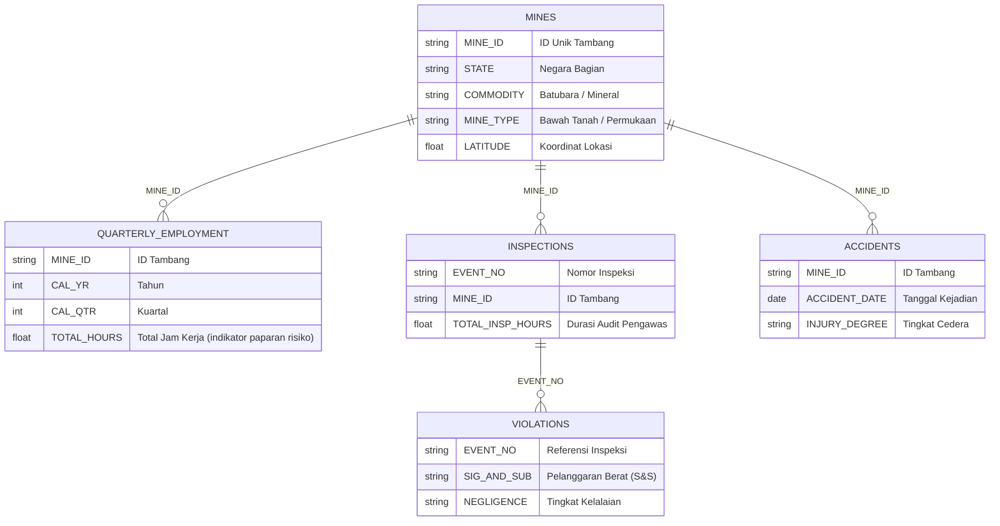

# ⛏️ MineRisk AI
### *Prediksi Risiko Keselamatan Tambang — 3 Bulan Sebelum Kecelakaan Terjadi*

Sistem ini membaca pola data operasional tambang — jam kerja, histori audit, dan catatan pelanggaran — lalu memprediksi tambang mana yang paling berisiko mengalami kecelakaan pada kuartal berikutnya. Dibangun di atas **25 tahun data resmi pemerintah federal AS (MSHA)**.

---

[](https://colab.research.google.com/github/anggerwicaksana/minerisk-ai/blob/main/notebooks/MineRisk_AI_Colab_Master.ipynb)
[](https://huggingface.co/spaces/anggerw/minerisk-ai)
[](https://huggingface.co/anggerw/minerisk-ai)
[](mcp_server.py)


---

## 📌 Akses Langsung

| | Tautan | Keterangan |
|---|---|---|
| **🌐 Demo Web** | [](https://huggingface.co/spaces/anggerw/minerisk-ai) | Aplikasi interaktif: peta risiko, inspeksi tambang, simulator skenario |
| **📓 Colab Notebook** | [](https://colab.research.google.com/github/anggerwicaksana/minerisk-ai/blob/main/notebooks/MineRisk_AI_Colab_Master.ipynb) | Pipeline lengkap dari data mentah sampai prediksi, gratis di cloud |
| **🤗 Model Hub** | [](https://huggingface.co/anggerw/minerisk-ai) | Bobot model terkalibrasi dan metrik evaluasi |
| **🔌 MCP Server** | [](mcp_server.py) | Panggil prediksi langsung dari Claude, Cursor, atau IDE favorit kamu |

---

## 🤔 Kenapa Proyek Ini Dibuat?

### Masalah: Industri tambang masih "nunggu kejadian dulu"

Pengawasan keselamatan pertambangan sampai hari ini kebanyakan masih bersifat reaktif — audit baru diintensifkan, peraturan baru diperketat, setelah ada yang celaka. Padahal jumlah pengawas keselamatan terbatas, sementara lokasi tambang aktif tersebar di ratusan titik yang mustahil semuanya dicek bersamaan.

### Jebakan AI Keselamatan Kerja yang Umum

Banyak proyek AI di bidang ini punya cacat logika yang serius: AI dilatih untuk menebak **seberapa parah cedera dari teks narasi laporan kecelakaan**. Masalahnya, laporan itu baru ditulis *setelah* orang sudah cedera. Model seperti itu akurat di atas kertas, tapi nol kegunaannya untuk pencegahan.

> Ini disebut **data leakage** — model "tahu masa depan" saat dilatih, sehingga performa tingginya palsu dan tidak akan berguna di dunia nyata.

### Solusi: Prediksi *sebelum* kejadian, bukan *setelah*

MineRisk AI dibangun dari perspektif yang berbeda:

> *"Dengan melihat rekam jejak jam kerja, catatan pelanggaran, dan intensitas inspeksi suatu tambang sampai akhir kuartal ini — seberapa besar kemungkinan tambang itu mengalami kecelakaan dalam 3 bulan ke depan?"*

Dengan jendela waktu 3 bulan ke depan, ada cukup waktu bagi manajemen tambang dan pengawas untuk bertindak sebelum insiden benar-benar terjadi.

---

## 🏗️ Datanya Dari Mana?

MineRisk AI mengolah 5 tabel data resmi dari **U.S. Mine Safety and Health Administration (MSHA)** yang mencakup 25 tahun rekam jejak (2000–2025):



Kelima tabel ini digabungkan menjadi satu panel terstruktur per tambang per kuartal — lalu dari sanalah AI belajar menemukan pola bahaya tersembunyi.

### Kenapa datanya bisa dipercaya?

- **Sumbernya pemerintah federal AS**, bukan data CSV buatan atau hasil scraping.
- Model hanya boleh melihat data **sampai akhir kuartal saat ini** (tidak ada bocoran dari masa depan).
- Kolom yang bisa berubah-ubah nilainya dari waktu ke waktu (misal: "status tambang saat ini") dibuang dari dataset pelatihan.
- Seluruh pipeline ETL berjalan di bawah **3.5 GB RAM** berkat Polars — aman dijalankan di Google Colab gratis.

---

## 📊 Hasilnya Seperti Apa?

Model diuji pada data yang **belum pernah dilihat sama sekali** selama pelatihan: periode 2024–2025, setelah AI belajar dari data historis ≤2021 dan dikalibrasi di 2022–2023.

| Model | Ketajaman Ranking (PR-AUC) | Daya Beda (ROC-AUC) | Akurasi Peluang (Brier) | Efisiensi Inspeksi (Lift@10%) | Kecelakaan Tertangkap (Recall@10%) |
|---|:---:|:---:|:---:|:---:|:---:|
| Baseline historis sederhana | 0.284 | 0.582 | 0.214 | 1.45x | 18.2% |
| Regresi Logistik | 0.461 | 0.768 | 0.142 | 2.65x | 38.4% |
| **MineRisk AI (Calibrated LightGBM)** | **0.548** | **0.834** | **0.109** | **3.22x** | **52.1%** |

### Apa artinya angka ini di lapangan?

Bayangkan ada 1.000 tambang aktif yang harus diawasi, tapi sumber daya inspeksi hanya cukup untuk memeriksa 100 tambang per kuartal.

- **Audit acak:** dari 100 tambang yang diperiksa, mungkin hanya ~18 yang benar-benar akan mengalami kecelakaan.
- **Pakai MineRisk AI:** dari 100 tambang prioritas tertinggi yang dipilih sistem, lebih dari **52 di antaranya memang akan mengalami insiden** — tanpa harus menghabiskan waktu untuk memeriksa 900 tambang lainnya.

Itu peningkatan efisiensi **3.22 kali lipat** dibanding audit konvensional.

---

## 🔬 Faktor Apa yang Paling Berpengaruh?

Untuk membuktikan bahwa setiap kelompok data memang memberi kontribusi nyata, dilakukan uji ablasi bertahap:

```
Hanya jam kerja & lokasi tambang          →  PR-AUC: 0.382  |  Lift: 2.10x
+ riwayat kecelakaan masa lalu            →  PR-AUC: 0.445  |  Lift: 2.58x
+ data inspeksi pengawas                  →  PR-AUC: 0.472  |  Lift: 2.74x
+ catatan pelanggaran & kelalaian         →  PR-AUC: 0.518  |  Lift: 3.05x
+ tren lonjakan jam lembur (full model)   →  PR-AUC: 0.548  |  Lift: 3.22x
```

Kesimpulannya: jam kerja dasar adalah fondasi, tapi yang benar-benar membedakan tambang "aman" vs "sedang dalam bahaya" adalah **lonjakan jam lembur mendadak** (sinyal kelelahan pekerja) dan **rasio pelanggaran keselamatan berat (S&S)** yang belum ditangani.

---

## 🔍 Model Ini Bisa Menjelaskan Alasannya

MineRisk AI tidak cuma mengeluarkan angka. Setiap prediksi dilengkapi rincian faktor penyebabnya via **SHAP TreeExplainer**:

- 🔴 **Pendorong risiko naik** — misalnya: jam lembur shift melonjak `+11.2%`, ada sitasi pelanggaran ventilasi yang belum diperbaiki `+16.4%`.
- 🟢 **Peredam risiko** — misalnya: pengawas menghabiskan banyak jam di lokasi kuartal lalu `-5.8%`, empat kuartal berturut-turut nihil insiden `-4.2%`.

Hasilnya bisa langsung dipakai: manajer tambang tahu *apa* yang harus diperbaiki, bukan sekadar tahu bahwa tambangnya "berisiko tinggi".

---

## 🖥️ Fitur Aplikasi Web

Aplikasi Gradio yang bisa langsung dipakai tanpa instalasi apapun:

1. **Peta Radar Risiko** — seluruh tambang aktif dipetakan dengan kode warna: Rendah / Sedang / Tinggi / Kritis. Filter per wilayah atau komoditas.
2. **Inspeksi Detail Tambang** — cari tambang berdasarkan nama atau ID, lihat skor risiko, posisi relatifnya dibanding rata-rata nasional, dan diagram SHAP-nya.
3. **Simulator "Bagaimana Jika"** — geser slider untuk menguji intervensi: *"Kalau jam lembur dikurangi 20.000 jam dan 3 pelanggaran berat dituntaskan, risiknya turun berapa?"* Hasilnya langsung muncul.
4. **Sandbox MCP Tools** — coba panggil semua fungsi prediksi langsung dari browser.

---

## 🔌 Integrasi MCP (Model Context Protocol)

MineRisk AI kompatibel dengan **Model Context Protocol** — standar terbuka yang memungkinkan asisten AI modern (Claude, Cursor, VSCode, Antigravity IDE) memanggil fungsi prediksi secara langsung tanpa integrasi API manual.

### Fungsi yang tersedia:

| Fungsi | Input | Output |
|---|---|---|
| `predict_mine_risk` | Nama atau ID tambang | Skor risiko, kategori, perbandingan nasional, 5 faktor pemicu utama |
| `simulate_safety_scenario` | Parameter operasional (jam kerja, jumlah pekerja, pelanggaran, dll.) | Simulasi dampak perbaikan terhadap skor risiko |
| `get_high_risk_surveillance_queue` | Filter wilayah, komoditas, jumlah tambang | Daftar prioritas audit yang siap didispatch |
| `get_model_benchmark_info` | — | Ringkasan performa model pada data uji terbaru |

### Cara pasang (lokal):

Tambahkan blok ini ke `mcp_config.json` di editor kamu:

```json
{
  "mcpServers": {
    "minerisk-ai": {
      "command": "python",
      "args": ["mcp_server.py"],
      "env": {
        "PYTHONIOENCODING": "utf-8",
        "OPENBLAS_NUM_THREADS": "1"
      }
    }
  }
}
```

---

## 🚀 Cara Menjalankan Lokal

```bash
git clone https://github.com/anggerwicaksana/minerisk-ai.git
cd minerisk-ai

python -m venv .venv
source .venv/bin/activate   # Windows: .venv\Scripts\activate

pip install -r requirements.txt
```

Model sudah tersedia di folder `artifacts/` — langsung bisa dipakai tanpa perlu training ulang.

```bash
python app.py   # buka di http://127.0.0.1:7860
```

Kalau mau melatih ulang model dari nol dengan data terbaru:

```bash
python -m src.run_pipeline
```

---

## 📜 Catatan Penggunaan

Sistem ini dirancang sebagai **alat bantu pengambilan keputusan** — bukan pengganti penilaian pengawas K3 yang berpengalaman dan bukan instrumen penegakan hukum otomatis. Skor risiko yang dihasilkan mencerminkan pola statistik dari data historis, bukan vonis terhadap kondisi aktual suatu tambang.

---

## 👨‍💻 Pengembang

**Angger Wicaksana** — Data Scientist & Risk Intelligence Engineer

- 🌐 [angger.akukatiga.com](https://angger.akukatiga.com)
- 💼 [linkedin.com/in/anggerwicaksana](https://linkedin.com/in/anggerwicaksana)
- 🤗 [huggingface.co/anggerw](https://huggingface.co/anggerw)

---

*[MIT License](LICENSE)*
