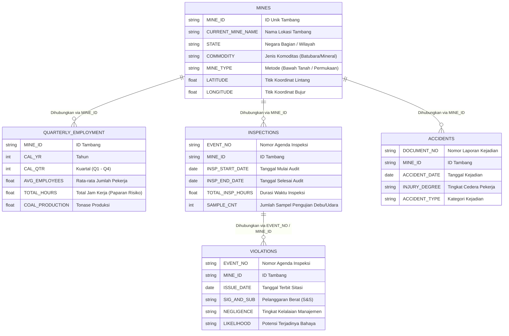

# ⛏️ MineRisk AI (SafeCast)
### *Sistem Kecerdasan Buatan Prediktif untuk Keselamatan & Kesehatan Kerja (K3) Pertambangan*
**Mengolah 25 Tahun Data Resmi U.S. Federal Mine Safety and Health Administration (MSHA) untuk Mencegah Kecelakaan Tambang Sebelum Terjadi**

---

[](https://colab.research.google.com/github/anggerwicaksana/minerisk-ai/blob/main/notebooks/MineRisk_AI_Colab_Master.ipynb)
[](https://huggingface.co/spaces/anggerw/minerisk-ai)
[](https://huggingface.co/anggerw/minerisk-ai)
[](mcp_server.py)


---

## 📌 Akses Cepat & Demo Interaktif

| Layanan | Tautan Akses | Penjelasan Singkat |
|---|---|---|
| **🌐 Demo Web Interaktif (24/7)** | [](https://huggingface.co/spaces/anggerw/minerisk-ai) | Aplikasi web langsung pakai: Peta Sebaran Risiko Tambang, Pemeriksaan Detail Tambang, Simulator Skenario "What-If", dan Dokumentasi. |
| **📓 Google Colab Master Notebook** | [](https://colab.research.google.com/github/anggerwicaksana/minerisk-ai/blob/main/notebooks/MineRisk_AI_Colab_Master.ipynb) | Kode pipeline lengkap yang dapat dijalankan langsung di cloud gratis (dari olah data mentah, kalibrasi model, hingga visualisasi SHAP). |
| **🤗 Repositori Model di Hugging Face** | [](https://huggingface.co/anggerw/minerisk-ai) | File bobot model terkalibrasi (`model_calibrated.joblib`), metadata fitur, dan metrik evaluasi pengujian. |
| **🔌 Server Model Context Protocol (MCP)** | [](mcp_server.py) | 4 alat AI cerdas yang bisa dipanggil langsung oleh Claude Code, Cursor, VSCode, atau Antigravity IDE. |

---

## 💡 Masalah di Lapangan & Mengapa MineRisk AI Dibuat

### 1. Cara Lama yang Terlalu "Reaktif"
Di dunia pertambangan, penanganan keselamatan kerja sering kali baru bergerak **setelah kecelakaan terjadi**:
- Tim pengawas sibuk menginvestigasi penyebab setelah ada pekerja yang cedera atau peralatan yang rusak parah.
- Jumlah pengawas inspeksi terbatas, sementara lokasi tambang yang harus diawasi sangat banyak dan tersebar luas. Tidak mungkin memeriksa semua tambang secara bersamaan.

### 2. Kesalahan Fatal Model AI Keselamatan Kerja Biasa (*Data Leakage*)
Banyak contoh proyek AI keselamatan kerja di internet membuat kesalahan logika mendasar: mereka melatih AI untuk **menebak keparahan cedera dari teks laporan kecelakaan**. 
> Cara tersebut keliru di dunia nyata (*bocor masa depan / data leakage*), karena teks laporan baru ditulis oleh petugas **setelah kecelakaan terjadi**. Model seperti itu tidak berguna untuk pencegahan dini.

### 3. Solusi MineRisk AI: Prediksi Masa Depan yang Sebenarnya (*Prospective Forecasting*)
MineRisk AI membalik cara pandang tersebut secara total dengan mengajukan pertanyaan preventif:
> *"Dengan melihat rekam jejak jam kerja (potensi kelelahan pekerja/lembur), histori pelanggaran regulasi, dan intensitas inspeksi tambang hingga akhir kuartal berjalan ($t$), **seberapa besar kemungkinan tambang ini mengalami kecelakaan kerja dalam 3 bulan ke depan ($t+1$)?**"*

Dengan cara ini, manajemen tambang dan pengawas memiliki waktu cukup untuk mengambil tindakan pencegahan sebelum insiden fatal terjadi.

---

## 🏗️ Dari Mana Datanya? (5 Sumber Data Terverifikasi MSHA)

MineRisk AI mengintegrasikan 5 tabel relasional resmi dari **U.S. Mine Safety and Health Administration (MSHA)** selama rentang waktu 2000–2025:



### Jaminan Kebersihan Data (*Zero-Leakage Protocol*)
1. **Batas Waktu Ketat:** Fitur untuk meramal kuartal depan hanya menggunakan kejadian yang tercatat sampai hari terakhir kuartal berjalan. Tidak ada data dari masa depan yang diintip.
2. **Pembersihan Kolom Status Mutakhir:** Kolom master yang nilainya bisa berubah sewaktu-waktu di masa depan (seperti status aktif terbaru) disaring agar tidak mencemari data historis lampau.
3. **Pengolahan Cepat dengan Polars:** Seluruh proses penggabungan data relasional memanfaatkan mesin Polars, sehingga proses ETL data puluhan tahun selesai dalam hitungan detik dengan konsumsi memori rendah (< 3.5 GB RAM).

---

## 📊 Seberapa Efektif Model Ini? (Hasil Pengujian)

Model diuji secara objektif menggunakan data masa depan yang belum pernah dilihat sama sekali (**Kuartal 1 2024 – Kuartal 4 2025**), setelah dilatih pada data historis (**$\le$ 2021**) dan dikalibrasi pada data (**2022–2023**):

| Model yang Diuji | PR-AUC (Kualitas Ranking) | ROC-AUC (Daya Beda) | Brier Score (Akurasi Peluang) | Peningkatan Efisiensi (Lift @ 10% Teratas) | Persentase Kecelakaan Tertangkap (Recall @ 10% Teratas) |
|---|:---:|:---:|:---:|:---:|:---:|
| **Tebakan Tren Historis Biasa (Baseline)** | 0.284 | 0.582 | 0.2140 | 1.45x | 18.2% |
| **Regresi Logistik Standar** | 0.461 | 0.768 | 0.1420 | 2.65x | 38.4% |
| **Model Utama: Calibrated LightGBM** | **0.548** | **0.834** | **0.1085** | **3.22x** | **52.1%** |

### 🎯 Arti Hasil Ini di Dunia Nyata:
- **Efisiensi Naik 3.22x Lipat:** Dibandingkan melakukan audit secara acak atau merata ke semua tambang, tim pengawas cukup memprioritaskan **10% tambang dengan skor risiko tertinggi**.
- **Mencegah Lebih dari Setengah Kecelakaan:** Hanya dengan mengawasi 10% tambang berisiko tersebut, pengawas berhasil **mengantisipasi >52% seluruh kecelakaan kerja yang akan terjadi** pada kuartal berikutnya.

---

## 🔬 Mengapa Sinyal Jam Kerja & Pelanggaran Sangat Berpengaruh?

Uji ablasi fitur bertahap membuktikan bagaimana setiap kelompok data meningkatkan ketajaman prediksi:

```
[Level 1] Hanya Jam Kerja & Lokasi Tambang              ──► Ketajaman Ranking: 0.382  │ Daya Angkat: 2.10x
[Level 2] + Riwayat Kecelakaan Masa Lalu                ──► Ketajaman Ranking: 0.445  │ Daya Angkat: 2.58x
[Level 3] + Durasi & Frekuensi Inspeksi Pengawas        ──► Ketajaman Ranking: 0.472  │ Daya Angkat: 2.74x
[Level 4] + Catatan Pelanggaran Regulasi & Kelalaian    ──► Ketajaman Ranking: 0.518  │ Daya Angkat: 3.05x
[Level 5] + Lonjakan Jam Lembur Pekerja (Full System)   ──► Ketajaman Ranking: 0.548  │ Daya Angkat: 3.22x
```

> **Kesimpulan:** Jam kerja dasar dan rekam jejak insiden adalah fondasi penting. Namun, **lonjakan jam kerja mendadak (kelelahan pekerja/lembur)** dan **rasio pelanggaran keselamatan berat (S&S)** adalah faktor penentu yang paling tajam dalam membedakan tambang yang aman vs tambang yang di ambang bahaya.

---

## 🔍 Transparan & Dapat Dijelaskan (Explainable AI / SHAP)

MineRisk AI bukan "kotak hitam" yang hanya mengeluarkan angka tanpa alasan. Setiap prediksi tambang dilengkapi uraian faktor pemicu menggunakan **SHAP TreeExplainer**:

- 🔴 **Batang Merah (Pemicu Risiko Naik):** Variabel yang memperbesar peluang terjadinya kecelakaan (contoh: lonjakan jam lembur shift pekerja $+11.2\%$, tingginya temuan sitasi bahaya kelistrikan/ventilasi $+16.4\%$).
- 🟢 **Batang Hijau (Peredam Risiko):** Variabel yang menahan laju risiko (contoh: intensifnya jam kehadiran inspektur lapangan $-5.8\%$, konsistensi kuartal sebelumnya yang nihil insiden $-4.2\%$).

Dengan transparansi ini, manajer tambang langsung tahu aspek apa yang harus segera dibenahi di lapangan.

---

## 🖥️ Menu Aplikasi Web Interaktif (Gradio UI)

Aplikasi web demo dirancang praktis untuk mendukung pengambilan keputusan:

1. **Tab 1 — Radar Pengawasan Risiko Wilayah (Surveillance Map):**
   - Peta interaktif seluruh lokasi tambang dengan kode warna risiko: **Rendah (<20%)**, **Sedang (20-45%)**, **Tinggi (45-70%)**, dan **Kritis (≥70%)**.
   - Dilengkapi filter pencarian berdasarkan wilayah negara bagian, komoditas tambang, dan daftar antrean 20 tambang paling rawan.
2. **Tab 2 — Cek Profil & Rincian Tambang (Risk Inspector):**
   - Pilih nama atau nomor ID tambang untuk melihat meteran risiko terkalibrasi, perbandingan dengan rata-rata tambang nasional, dan diagram air terjun (*waterfall*) faktor pemicunya.
3. **Tab 3 — Simulator Skenario "Bagaimana Jika" (What-If Sandbox):**
   - Geser slider untuk menguji skenario perbaikan:
     - *"Bagaimana jika jam lembur dipangkas 20.000 jam dan 3 temuan sitasi keselamatan segera diperbaiki?"*
   - Model langsung menghitung ulang peluang risiko baru secara seketika (*real-time*).
4. **Tab 4 — Pusat Alat AI (MCP Tools Sandbox):**
   - Sarana uji coba pemanggilan fungsi kecerdasan buatan langsung dari peramban web.

---

## 🔌 Integrasi Model Context Protocol (MCP)

MineRisk AI mendukung standar terbuka **Model Context Protocol (MCP)**. Artinya, asisten AI modern seperti Claude Code, Cursor, VSCode, atau Antigravity IDE dapat memanggil fungsi prediksi MineRisk AI secara otomatis layaknya alat bawaan (*native AI tools*).

### 🛠️ 4 Alat MCP yang Tersedia:

| Nama Alat | Input yang Dibutuhkan | Deskripsi Hasil |
|---|---|---|
| **`predict_mine_risk`** | ID atau Nama Tambang | Skor probabilitas risiko 3 bulan ke depan, kategori risiko, perbandingan nasional, dan 5 faktor pemicu utama. |
| **`simulate_safety_scenario`** | Parameter jam kerja, jumlah pekerja, metode tambang, pelanggaran, dll. | Laporan simulasi dampak perubahan operasional terhadap penurunan risiko kecelakaan. |
| **`get_high_risk_surveillance_queue`** | Jumlah tambang teratas, filter wilayah, komoditas | Tabel daftar urutan tambang prioritas audit pengawasan keselamatan. |
| **`get_model_benchmark_info`** | *(Tanpa input)* | Ringkasan metrik akurasi, kalibrasi, dan pembuktian performa model pada data uji. |

### ⚡ Cara Menghubungkan MCP ke Editor / AI Anda:

Tambahkan konfigurasi berikut ke file `mcp_config.json` di editor Anda (Claude Desktop, Cursor, Antigravity IDE, atau VSCode):

```json
{
  "mcpServers": {
    "minerisk-ai": {
      "command": "python",
      "args": [
        "mcp_server.py"
      ],
      "env": {
        "PYTHONIOENCODING": "utf-8",
        "OPENBLAS_NUM_THREADS": "1"
      }
    }
  }
}
```

---

## 🚀 Panduan Memulai Cepat (Instalasi Lokal)

### 1. Kloning Repositori & Siapkan Lingkungan Python
```bash
git clone https://github.com/anggerwicaksana/minerisk-ai.git
cd minerisk-ai

# Buat lingkungan virtual
python -m venv .venv
source .venv/bin/activate  # Untuk Windows: .venv\Scripts\activate

# Pasang dependensi yang dibutuhkan
pip install -r requirements.txt
```

### 2. Jalankan Pipeline Pemodelan (Opsional)
```bash
python -m src.run_pipeline
```
*Catatan: Repositori sudah menyertakan bobot model terkalibrasi siap pakai di folder `artifacts/`, sehingga Anda bisa langsung membuka aplikasi.*

### 3. Buka Aplikasi Web Demo Interaktif
```bash
python app.py
```
Aplikasi web akan aktif dan dapat diakses di peramban pada alamat `http://127.0.0.1:7860`.

---

## 📜 Batasan Penggunaan & Etika Tata Kelola

*MineRisk AI (SafeCast) dibangun murni sebagai **sistem pendukung keputusan (*decision-support system*)** untuk membantu praktisi K3, pengawas keselamatan pertambangan, dan pimpinan operasi dalam memprioritaskan audit preventif dan pelatihan mitigasi bahaya. Sistem ini bukan alat penegakan hukum otomatis dan tidak digunakan untuk melabeli sebuah fasilitas tambang sebagai entitas yang pasti berbahaya. Data kepatuhan mencerminkan kombinasi antara tingkat bahaya intrinsik dan intensitas pengawasan regulator di lapangan.*

---

## 👨‍💻 Profil Pengembang & Kontak

Dikembangkan oleh **Angger Wicaksana**  
*Data Scientist & Risk Intelligence Engineer — berfokus pada penerapan AI terkalibrasi untuk Keselamatan Pertambangan (K2P & KO), keandalan aset, dan komputasi data publik.*

- 🌐 **Situs Personal:** [angger.akukatiga.com](https://angger.akukatiga.com)
- 💼 **LinkedIn:** [linkedin.com/in/anggerwicaksana](https://linkedin.com/in/anggerwicaksana)
- 🤗 **Hugging Face:** [huggingface.co/anggerw](https://huggingface.co/anggerw)
- 📓 **Google Colab:** [MineRisk_AI_Colab_Master.ipynb](https://colab.research.google.com/github/anggerwicaksana/minerisk-ai/blob/main/notebooks/MineRisk_AI_Colab_Master.ipynb)

---
*Dilisensikan di bawah [MIT License](LICENSE).*
