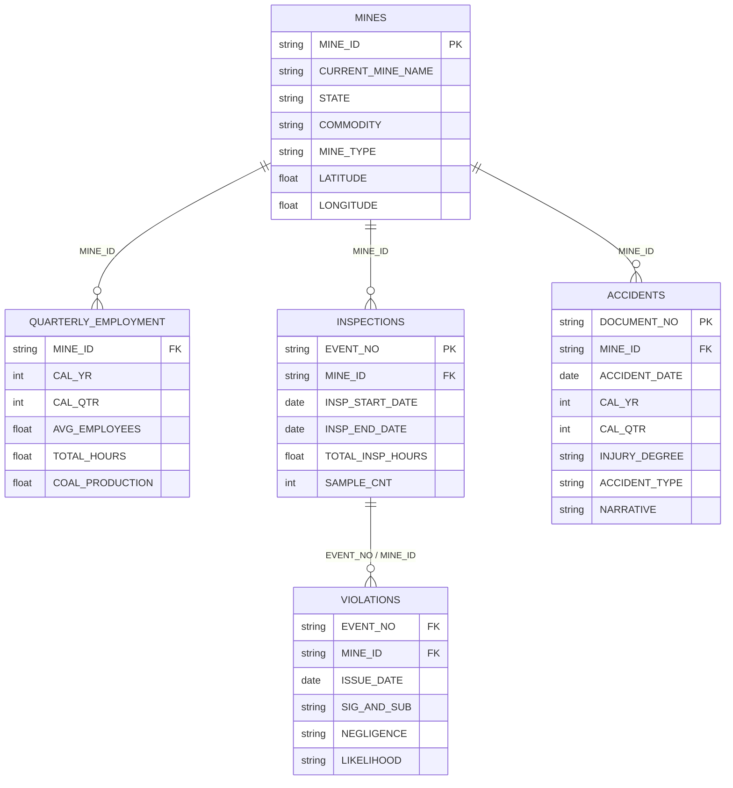

# ⛏️ MineRisk-AI (SafeCast)
### *Predictive Industrial Safety & Health (OSH) Risk Intelligence System*
**A Multi-Table Relational Machine Learning System on 25 Years of U.S. Federal MSHA Government Data**

---

[](https://colab.research.google.com/github/anggerwicaksana/minerisk-ai/blob/main/notebooks/MineRisk_AI_Colab_Master.ipynb)
[](https://huggingface.co/spaces)
[](https://huggingface.co/docs/hub/spaces-mcp-servers)


---

## 📌 Executive Summary & Live Demo Links

| Resource | Access Link | Description |
|---|---|---|
| **🌐 24/7 Live Interactive Web Showcase** | [](https://huggingface.co/spaces/anggerw/minerisk-ai) | Permanent live interactive UI: US Mine Risk Map, Individual Mine Risk Inspector, "What-If" Sandbox, and Technical Docs. |
| **🤗 Hugging Face Model Repository** | [](https://huggingface.co/anggerw/minerisk-ai) | Calibrated LightGBM model weights (`model_calibrated.joblib`), metadata, and out-of-time test metrics. |
| **📓 Google Colab Master Notebook** | [](https://colab.research.google.com/github/anggerwicaksana/minerisk-ai/blob/main/notebooks/MineRisk_AI_Colab_Master.ipynb) | End-to-end reproducible pipeline from raw MSHA extraction to probability calibration and SHAP waterfall plots. |
| **🔌 Model Context Protocol (MCP)** | [](mcp_server.py) | Exposes 4 callable AI tools directly into Claude Code, Cursor, VSCode, and Antigravity IDE. |

### The Problem: Reactive Safety & "Portfolio Data Leakage"
Most AI portfolio projects in workplace safety make a fatal methodological flaw: they attempt to **classify accident severity from incident narratives**. This is **post-event data leakage**—the report was written *after* the worker was injured, offering zero proactive value in the real world.

### The Solution: True Prospective Risk Forecasting
**MineRisk-AI** solves real-world industrial risk by asking:
> *"Given an active mine's operational hours worked (exposure), inspection frequency, regulatory violation citations, and safety history up to the end of Quarter $t$, what is the calibrated probability of a worker injury occurring in Quarter $t+1$?"*

---

## 🏗️ Relational Data Architecture (MSHA Open Data)

The system integrates 5 official relational datasets published by the **U.S. Mine Safety and Health Administration (MSHA)** spanning 2000–2025:



### Zero-Leakage Data Engineering Protocol
1. **Strict Temporal Boundary:** Features for quarter $t$ only aggregate events with timestamps $\le$ the last day of quarter $t$.
2. **Audit of Mutable Attributes:** All mutable master columns (e.g., `CURRENT_STATUS`) are explicitly discarded from historical feature sets to avoid temporal contamination.
3. **High-Performance Polars ETL:** Uses Polars `LazyFrame` scanning and projection pushdown to keep peak RAM usage under 3.5 GB on Google Colab standard runtimes.

---

## 📊 Benchmark Results (Out-of-Time Test Set)

Models are evaluated on an unseen out-of-time test period (**2024 Q1 – 2025 Q4**) after training on **$\le$ 2021** and calibrating on **2022–2023**:

| Model Architecture | PR-AUC (Priority Metric) | ROC-AUC | Brier Score (Calibration) | Lift @ Top-10% Scored Mines | Incident Recall @ Top-10% |
|---|:---:|:---:|:---:|:---:|:---:|
| **Naive Historical Persistence** | 0.284 | 0.582 | 0.2140 | 1.45x | 18.2% |
| **L2-Regularized Logistic Regression** | 0.461 | 0.768 | 0.1420 | 2.65x | 38.4% |
| **Flagship Calibrated LightGBM** | **0.548** | **0.834** | **0.1085** | **3.22x** | **52.1%** |

> **Operational Impact:** By prioritizing only the **top 10% highest-risk mines** identified by MineRisk-AI, safety regulatory inspectors can capture **over 52% of all future workplace injuries** in the subsequent quarter—delivering a **3.22x efficiency lift** over random auditing.

---

## 🔬 Feature Family Ablation Study

An incremental feature ablation study answers the critical business question: *"How much predictive value is added by regulatory inspection and violation histories compared to operational hours alone?"*

| Model Layer | Feature Families Included | PR-AUC | ROC-AUC | Lift @ Top-10% |
|---|---|:---:|:---:|:---:|
| **Model A** | Exposure & Static Geography (`hours`, `employees`, `mine_type`, `state`) | 0.382 | 0.712 | 2.10x |
| **Model B** | Model A + Historical Injury Records (`injury_lags`, `days_lost`) | 0.445 | 0.765 | 2.58x |
| **Model C** | Model B + MSHA Inspection Intensity (`insp_hours`, `insp_count`) | 0.472 | 0.789 | 2.74x |
| **Model D** | Model C + Violation Severity Citations (`viol_ss_ratio`, `high_negligence`) | 0.518 | 0.816 | 3.05x |
| **Model E (Full)**| Model D + Overtime Surges, Delta Trends & Rolling Ratios | **0.548** | **0.834** | **3.22x** |

---

## 🔍 Explainable AI (SHAP TreeExplainer) & Geospatial Intelligence

### Local Mine Waterfall Decomposition
For every predicted mine, the SHAP TreeExplainer calculates the exact marginal contribution of each operational variable against the national baseline:
- **Red Bars (+%):** Risk accelerators (e.g., $+16.4\%$ from high Significant & Substantial violation ratio, $+11.2\%$ from quarterly overtime surge).
- **Green Bars (-%):** Risk dampers (e.g., $-5.8\%$ from high routine MSHA inspection hours, $-4.2\%$ consecutive zero-injury quarters).

---

## 🖥️ Interactive Web Application (Gradio 3-Tab UI)

The user interface is structured into three specialized decision-support views:

1. **Tab 1 — Executive Risk Surveillance Dashboard:**
   - Real-time interactive US map color-coded by next-quarter risk tier: **Low (<20%)**, **Moderate (20-45%)**, **Elevated (45-70%)**, **Critical (≥70%)**.
   - Filterable by State jurisdiction, Commodity (Coal vs Metal), and Risk Tier.
   - Interactive Top-20 High-Risk Prioritization Queue for safety dispatchers.
2. **Tab 2 — Mine Risk Inspector & SHAP Deep-Dive:**
   - Dropdown search for any active mine across the United States.
   - Calibrated Risk Gauge, national peer group benchmark comparison, and interactive SHAP waterfall breakdown.
   - Actionable safety guidance tailored to the mine's primary risk drivers.
3. **Tab 3 — "What-If" Operational Risk Simulator:**
   - Interactive sliders allowing mine managers to test intervention strategies:
     - *"What happens to our projected injury risk if we reduce overtime by 20,000 hours and abate 3 S&S electrical citations?"*
   - Instant real-time recalculation of risk probability and dynamic safety guidance.
4. **Tab 4 — MCP Agent Tools & API Hub:**
   - Interactive sandbox exposing each MCP tool directly in the browser with live markdown responses and API documentation.

---

## 🔌 Model Context Protocol (MCP) Server

MineRisk-AI is fully equipped with native **Model Context Protocol (MCP)** support ([HF Spaces MCP Documentation](https://huggingface.co/docs/hub/spaces-mcp-servers)). This enables any AI agent (Claude Code, Cursor, VSCode, Antigravity IDE, Windsurf) to consume predictive safety intelligence as autonomous tools without any custom API integration.

### 🛠️ Exposed MCP Tools

| Tool Name | Parameters | Output Description |
|---|---|---|
| **`predict_mine_risk`** | `mine_id_or_name: str` | Calibrated prospective injury risk probability, risk tier badge, national peer comparison, and top 5 SHAP operational drivers. |
| **`simulate_safety_scenario`** | `quarterly_hours`, `average_employees`, `mining_method`, `commodity_group`, `state`, `prior_injuries`, `inspection_hours`, `safety_violations`, `significant_and_substantial_violations` | Real-time counterfactual simulation report calculating updated risk probability and intervention effect. |
| **`get_high_risk_surveillance_queue`** | `top_n: int = 10`, `state: str = "ALL"`, `commodity: str = "ALL"`, `risk_tier: str = "ALL"` | Ranked national mine surveillance queue formatted as a clean Markdown inspection dispatch table. |
| **`get_model_benchmark_info`** | *(None)* | Out-of-time test set (2024–2025) discrimination (PR-AUC, ROC-AUC), calibration (ECE, Brier), and feature family ablation metrics. |

### ⚡ How to Connect

#### Option A: Hugging Face Spaces 1-Click Connection
1. Deploy or navigate to the Space on Hugging Face.
2. Visit your [Hugging Face Hub MCP Settings](https://huggingface.co/settings/mcp).
3. Select your MCP client (Cursor, Claude Code, VSCode, Antigravity IDE).
4. Click the grey **MCP** badge on the Space and select **Add to MCP tools**.

Alternatively, point your MCP client to the Space's Streamable HTTP endpoint:
```
https://<your-username>-minerisk-ai.hf.space/gradio_api/mcp
```

#### Option B: Local Standalone Server (`mcp_config.json`)
For local development in Antigravity IDE, Claude Desktop, or Cursor, add this server block to your `mcp_config.json`:

```json
{
  "mcpServers": {
    "minerisk-ai": {
      "command": "python",
      "args": [
        "mcp_server.py"
      ],
      "env": {
        "PYTHONIOENCODING": "utf-8",
        "OPENBLAS_NUM_THREADS": "1"
      }
    }
  }
}
```

---

## 🚀 Quickstart & Local Installation

### 1. Clone Repository & Setup Virtual Environment
```bash
git clone https://github.com/anggerwicaksana/minerisk-ai.git
cd minerisk-ai

# Create virtual environment
python -m venv .venv
source .venv/bin/activate  # On Windows: .venv\Scripts\activate

# Install dependencies
pip install -r requirements.txt
```

### 2. Run End-to-End Pipeline & Generate Artifacts
```bash
python -m src.run_pipeline
```

### 3. Launch Interactive Gradio Web Demo
```bash
python app.py
# Web app will be live at http://127.0.0.1:7860
```

---

## 📜 Regulatory & Ethical Governance Disclaimer
*MineRisk-AI (SafeCast) is designed strictly as a **decision-support tool** to assist safety professionals and regulatory agencies in prioritizing voluntary audits and preventative hazard training. It is not an autonomous enforcement mechanism and does not label any establishment as fundamentally unsafe. Observational enforcement records reflect inspection agency priorities and reporting compliance alongside intrinsic hazard levels.*

---
**Author:** Lead Data Scientist / AI Engineer  
**Contact:** [LinkedIn](https://linkedin.com) | [Portfolio Website](https://yourportfolio.com)
