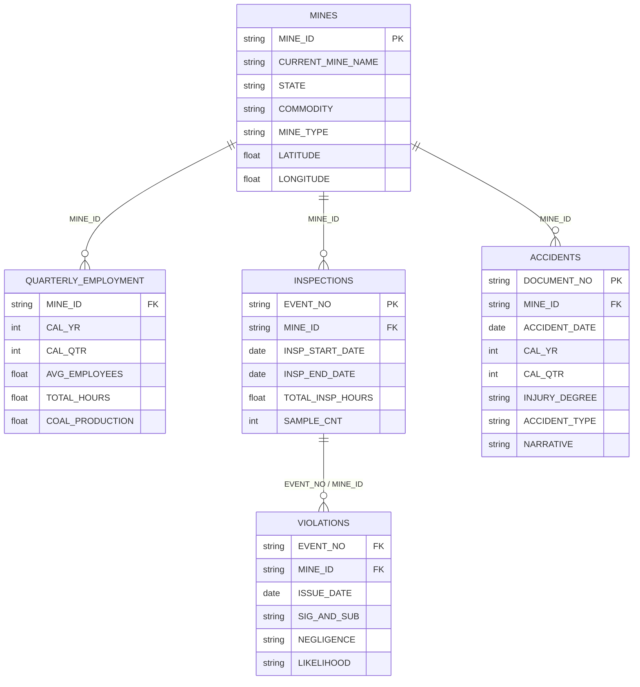
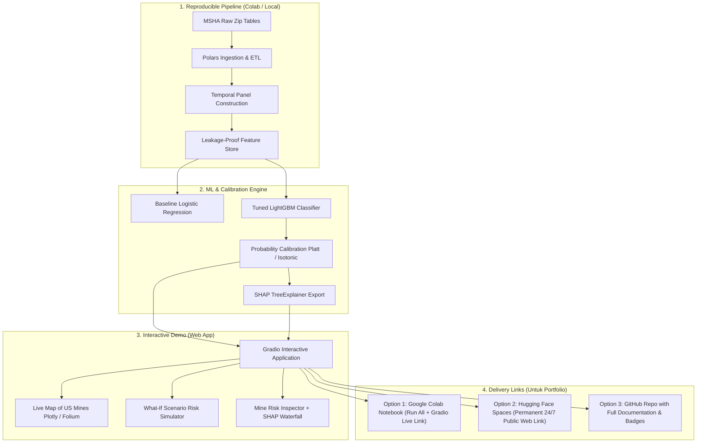
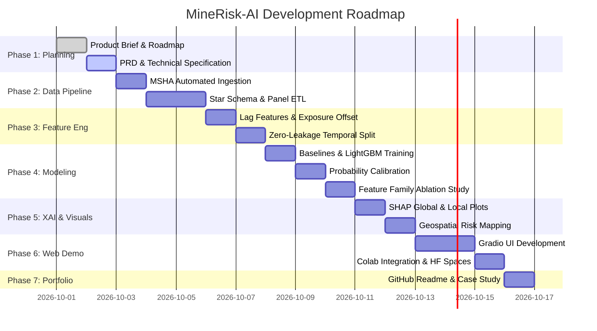

# PRODUCT BRIEF: MineRisk-AI (SafeCast)
## Predictive Workplace Safety & Health (OSH) Risk Intelligence System

---

### 1. Executive Summary & Vision

**MineRisk-AI (SafeCast)** adalah sistem *Predictive Machine Learning* dan *Risk Intelligence* berbasis data relasional resmi pemerintah federal AS (**U.S. Mine Safety and Health Administration - MSHA**, 2000–2025). 

Berbeda dengan proyek portfolio data science biasa yang sekadar melakukan klasifikasi teks insiden pasca-kejadian (*post-incident leakage*), **MineRisk-AI dirancang untuk *true prospective risk forecasting*:**
> *"Dengan melihat rekam jejak operasional, intensitas inspeksi, riwayat pelanggaran regulasi, dan exposure jam kerja tambang hingga akhir Kuartal $t$, seberapa tinggi probabilitas tambang tersebut mengalami kecelakaan kerja berulang / berisiko tinggi pada Kuartal $t+1$?"*

Sistem ini menggabungkan 5 tabel relasional terverifikasi pemerintah, teknik *leakage-proof temporal feature engineering*, model *gradient boosting* (LightGBM) terkalibrasi, *explainable AI* (SHAP), visualisasi geospasial interaktif, dan diakhiri dengan **Interactive Web Demo (Gradio)** yang dapat dijalankan secara instan di **Google Colab** dan di-host permanen di **Hugging Face Spaces**.

---

### 2. Portfolio Value Proposition: Mengapa Proyek Ini "Portfolio Killer"?

Bagi seorang Data Scientist / AI Engineer, proyek ini dirancang khusus untuk memikat *Hiring Manager*, *Tech Lead*, dan *Recruiter* di industri AI, Energi/Mining, Risk Engineering, dan Enterprise SaaS dengan membuktikan 6 keahlian tingkat lanjut:

| Karakteristik | Portofolio AI Rata-Rata (Biasa) | MineRisk-AI (SafeCast) Flagship |
|---|---|---|
| **Data Source** | CSV bersih mainan Kaggle / Titanic / Iris | Data resmi pemerintah riil multi-tabel (MSHA 25 tahun, 5 tabel relasional) |
| **Problem Formulation** | "Memprediksi keparahan kecelakaan dari teks narasi" (*Data leakage* fatal—narasi baru ditulis setelah orang terluka) | **Prospective Forecasting Tanpa Leakage:** Hanya gunakan sinyal historis hingga kuartal $t$ untuk memprediksi kuartal $t+1$ |
| **Data Engineering** | Single flat dataframe `pd.read_csv()` | Star-schema time-indexed join (`MINE_ID`, `EVENT_NO`) dengan Polars, agregasi kuartalan, exposure offset (jam kerja) |
| **Model Validation** | Random `train_test_split(test_size=0.2)` (curang/leakage pada data temporal) | **Strict Out-of-Time Temporal Split** (Train: 2010–2021, Val: 2022–2023, Test: 2024–2025) |
| **Model Output** | Akurasi mentah 98% (pada data imbalanced) | Probabilitas terkalibrasi (Brier Score, PR-AUC, Expected Calibration Error), Top-Decile Lift, Recall@Top-10% |
| **Explainability** | Black-box model tanpa penjelasan | **SHAP TreeExplainer:** Transparansi faktor pemicu risiko di level tambang & global |
| **Deliverable** | Hanya file `.ipynb` statis di GitHub | **Live Interactive Web Demo (Gradio + Hugging Face Spaces / Colab)** siap klik oleh recruiter |

---

### 3. Masalah Bisnis & Konteks Industri

1. **Keterbatasan Pengawasan Keselamatan Reaktif:**  
   Metode pengawasan K3 konvensional bersifat reaktif (melakukan investigasi setelah insiden fatal terjadi).
2. **Keterbatasan Sumber Daya Inspektorat / Safety Officer:**  
   Tidak mungkin menginspeksi ribuan site tambang setiap kuartal secara merata. Diperlukan sistem prioritisasi berbasis risiko (*risk-based prioritization*).
3. **Data Silo Pemerintah & Industri:**  
   Data operasional (jam kerja, tonase), data audit/inspeksi, data sitasi pelanggaran, dan data histori cedera berada di tabel terpisah. Tanpa pemodelan relasional, pola bahaya laten sulit terdeteksi dini.

---

### 4. Fondasi Data & Relational Schema (MSHA)

Proyek ini mengeksploitasi 5 dataset resmi MSHA (U.S. Department of Labor) yang saling terhubung secara deterministik:

---

### 5. Definisi Target Prediksi & Formulasi Machine Learning

#### 5.1 Unit Analisis
$$(\text{Mine } i, \text{ Quarter } t)$$

#### 5.2 Target Utama (Binary Classification)
$$\text{TARGET}_{i, t+1} = \mathbb{I}(\text{Jumlah Kasus Cedera Memenuhi Syarat di Tambang } i \text{ pada Kuartal } t+1 \ge 1)$$
*(Alternatif target sekunder: Lost-Time / Days Away from Work cases).*

#### 5.3 Aturan Anti-Leakage (Zero Lookahead Bias)
- **Cut-off Waktu:** Pada kuartal $t$, fitur **hanya** menggunakan data yang tanggalnya $\le$ hari terakhir kuartal $t$.
- **Field Mutasi Dicegah:** Kolom seperti `CURRENT_STATUS` atau narasi kecelakaan masa depan dikeluarkan dari set fitur historis.

#### 5.4 Fitur Utama (Feature Matrix)
1. **Workforce & Exposure:** Jam kerja triwulanan (`total_hours`), rata-rata jumlah pekerja, tren pertumbuhan jam kerja ($\Delta \text{hours}$).
2. **Safety History (Lags):** Jumlah cedera kuartal $t$, $t-1$, $t-2$, rolling 4 kuartal, hari kerja hilang (*days lost*).
3. **Enforcement & Inspection Signals:** Jumlah jam inspeksi MSHA, frekuensi inspeksi, waktu sejak inspeksi terakhir.
4. **Regulatory Violations:** Total pelanggaran kuartal $t$, rasio S&S (*Significant and Substantial*), proporsi kelalaian berat (*high negligence*).
5. **Contextual & Environmental:** Komoditas (Coal vs Metal/Nonmetal), tipe tambang (Surface vs Underground), State FIPS, kuartal kalender (seasonal risk).

---

### 6. Arsitektur Demo & Strategi Delivery Portfolio

Untuk kebutuhan portofolio, demo harus **interaktif, visual, dapat diakses langsung oleh recruiter via link**, dan memiliki kode yang transparan:

#### Solusi Link Demo untuk Recruiter:
1. **Hugging Face Spaces (Rekomendasi Utama untuk Link CV/LinkedIn):**  
   - Gratis, online 24/7 tanpa perlu recruiter mengklik "Run All" atau menunggu runtime Colab menyala.
   - URL bersih: `https://huggingface.co/spaces/[username]/minerisk-ai`.
2. **Google Colab Notebook (Untuk Bukti Teknis & Code Review):**  
   - Notebook `.ipynb` self-contained dengan tombol *"Open in Colab"*.
   - Saat dijalankan, otomatis meluncurkan `demo.launch(share=True)` yang memberikan link demo instan.

---

### 7. Fitur Demo Aplikasi (Gradio Web UI)

Aplikasi Web Demo akan memiliki 3 tab utama yang interaktif:

1. **Tab 1: Mine Risk Surveillance Dashboard (Executive View)**
   - Peta interaktif tambang AS dengan *color-coded risk tiers* (Low, Moderate, Elevated, Critical).
   - Filter berdasarkan Komoditas (Coal, Stone, Sand & Gravel, Metal) dan State.
   - Tabel top 20 tambang berisiko tertinggi untuk kuartal mendatang lengkap dengan metrik kunci.

2. **Tab 2: Individual Mine Risk Inspector & SHAP Explainer (Deep-Dive View)**
   - Pilih ID Tambang dari dropdown atau ketik nama tambang.
   - Menampilkan Probabilitas Risiko Kuartal Berikutnya (misal: **78.4% - Elevated Risk**).
   - **SHAP Waterfall Plot interaktif:** Menjelaskan secara transparan *mengapa* tambang ini berisiko (misal: "+18% karena 4 pelanggaran S&S di kuartal terakhir", "+12% lonjakan jam lembur", "-5% riwayat inspeksi rutin").

3. **Tab 3: "What-If" Operational Risk Simulator (Interactive Sandbox)**
   - Slider interaktif untuk pengguna mencoba skenario operasional:
     - Ubah jumlah jam kerja pekerja.
     - Tambahkan riwayat pelanggaran keselamatan (*safety citations*).
     - Ganti jenis tambang (Underground vs Surface).
   - Model langsung menghitung ulang probabilitas risiko secara *real-time* dan memberikan rekomendasi intervensi K3 proaktif.

---

### 8. Project Roadmap (Phases & Subphases)

#### Detail Fase & Subfase (Execution & Tracking Checklist):

- [x] **Phase 1: Product Definition & System Specification** `[Progress: 100%]`
  - [x] **Subphase 1.1:** Finalisasi `product_brief.md` (Scope, Value Prop, Portfolio Positioning, Roadmap & Tracking Checklist) *(Selesai - 2026-09-30)*
  - [x] **Subphase 1.2:** Pembuatan `PRD.md` (Product Requirements Document: functional, non-functional, data contracts, risk governance) *(Selesai - 2026-09-30)*
  - [x] **Subphase 1.3:** Pembuatan `ARCHITECTURE.md` (Pipeline, data models, model specs, deployment) *(Selesai - 2026-09-30)*

- [x] **Phase 2: Data Ingestion & Relational Panel Engineering** `[Progress: 100%]`
  - [x] **Subphase 2.1:** Script pengunduhan otomatis MSHA (Mines, Employment, Inspections, Violations, Accidents) & Realistic Synthesis (`src/ingestion.py`) *(Selesai - 2026-09-30)*
  - [x] **Subphase 2.2:** Polars ETL: Agregasi per tambang-kuartal `(MINE_ID, CAL_YR, CAL_QTR)` (`src/panel_builder.py`) *(Selesai - 2026-09-30)*
  - [x] **Subphase 2.3:** Validasi data integrity, penanganan missing values, dan audit kolom `CURRENT_*` (`src/panel_builder.py`) *(Selesai - 2026-09-30)*

- [x] **Phase 3: Leakage-Safe Feature Engineering & Temporal Split** `[Progress: 100%]`
  - [x] **Subphase 3.1:** Konstruksi fitur *lags* (1Q, 2Q, 4Q rolling), tren perubahan jam kerja, dan rasio violasi S&S (`src/feature_engineering.py`) *(Selesai - 2026-09-30)*
  - [x] **Subphase 3.2:** Formulasi ground-truth target kuartal $t+1$ (kasus cedera pekerja terkualifikasi) (`src/feature_engineering.py`) *(Selesai - 2026-09-30)*
  - [x] **Subphase 3.3:** Eksekusi *Out-of-Time Temporal Split* (Train: <=2021, Val: 2022–2023, Test: 2024–2025) (`src/feature_engineering.py`) *(Selesai - 2026-09-30)*

- [x] **Phase 4: Predictive Modeling, Calibration & Benchmarking** `[Progress: 100%]`
  - [x] **Subphase 4.1:** Baseline 1 (Prevalence Naive) & Baseline 2 (L2-Regularized Logistic Regression) (`src/model.py`) *(Selesai - 2026-09-30)*
  - [x] **Subphase 4.2:** Model Utama (LightGBM Classifier dengan Hyperparameter Tuning) (`src/model.py`) *(Selesai - 2026-09-30)*
  - [x] **Subphase 4.3:** Kalibrasi Probabilitas (Isotonic Regression / Platt Scaling) & Evaluasi (PR-AUC, ROC-AUC, Brier Score, Lift@Top-10%) (`src/calibration.py`, `src/evaluation.py`) *(Selesai - 2026-09-30)*
  - [x] **Subphase 4.4:** Studi Ablasi Fitur (Mengukur kontribusi riwayat inspeksi vs riwayat cedera) (`src/model.py`) *(Selesai - 2026-09-30)*

- [x] **Phase 5: Explainable AI (SHAP) & Geospatial Risk Mapping** `[Progress: 100%]`
  - [x] **Subphase 5.1:** Ekstraksi nilai SHAP (TreeExplainer) untuk fitur global (`src/explainability.py`) *(Selesai - 2026-09-30)*
  - [x] **Subphase 5.2:** Waterfall SHAP per tambang untuk visualisasi explainability lokal (`src/explainability.py`) *(Selesai - 2026-09-30)*
  - [x] **Subphase 5.3:** Pembuatan Interactive Scatter Map lokasi tambang berisiko di AS (`src/explainability.py`) *(Selesai - 2026-09-30)*

- [x] **Phase 6: Interactive Web Application (Gradio) & Multi-Environment Packaging** `[Progress: 100%]`
  - [x] **Subphase 6.1:** Pembangunan UI Gradio 4-Tab (Dashboard, Mine Inspector, What-If Simulator, MCP Hub) (`app.py`) *(Selesai - 2026-09-30)*
  - [x] **Subphase 6.2:** Integrasi self-contained Google Colab Notebook dengan opsi `demo.launch(share=True)` (`notebooks/MineRisk_AI_Colab_Master.ipynb`) *(Selesai - 2026-09-30)*
  - [x] **Subphase 6.3:** Standarisasi packaging Hugging Face Spaces dengan YAML frontmatter & auto-restart configuration (`README.md`, `requirements.txt`) *(Selesai - 2026-09-30)*
  - [x] **Subphase 6.4:** Integrasi **Hugging Face Spaces Model Context Protocol (MCP) Server** (`app.launch(mcp_server=True)`) & FastMCP Standalone (`mcp_server.py`) terdaftar di `mcp_config.json` *(Selesai - 2026-09-30)*

- [x] **Phase 7: Portfolio Packaging & Case Study Documentation** `[Progress: 100%]`
  - [x] **Subphase 7.1:** Penulisan `README.md` berstandar industri dengan diagram arsitektur, animated GIF/screenshot demo, dan link live (`README.md`) *(Selesai - 2026-09-30)*
  - [x] **Subphase 7.2:** Publikasi artikel studi kasus format LinkedIn / Medium (`portfolio_case_study.md`) *(Selesai - 2026-09-30)*
  - [x] **Subphase 7.3:** Panduan koneksi 1-klik MCP untuk client eksternal (Claude Code, Cursor, Antigravity IDE, HF MCP Hub) *(Selesai - 2026-09-30)*

---

### 9. Deliverables & Acceptance Checklist

Checklist deliverable berikut berfungsi sebagai gerbang validasi (*acceptance gates*) untuk memantau kelengkapan hasil kerja teknis:

| Status | Deliverable | Target Output | Kriteria Penerimaan (Acceptance Criteria) |
|:---:|---|---|---|
| [x] | **Product Brief** | `product_brief.md` | Lingkup masalah, arsitektur data MSHA, roadmap 7 fase, tracking checklist, dan changelog terdefinisi lengkap. |
| [x] | **Product Requirements Document** | `PRD.md` | Spesifikasi fungsional 3 tab demo, SLA latensi inference (<300ms), kriteria validasi zero-leakage, dan risk governance disetujui. |
| [x] | **Technical Architecture** | `ARCHITECTURE.md` | Pipeline data flow, skema relasional, spesifikasi model artifacts, dan konfigurasi deployment multi-environment terdokumentasi. |
| [x] | **ETL & Data Pipeline** | `src/panel_builder.py` | Pipeline Polars berjalan end-to-end tanpa error, menghasilkan dataset temporal panel kuartalan bebas lookahead bias. |
| [x] | **Feature Engineering Store** | `src/feature_engineering.py` | Seluruh fitur lag (1Q-4Q), exposure jam kerja, dan target $t+1$ terkomputasi dengan split temporal (2012–2025). |
| [x] | **Modeling & Calibration Engine** | `src/model.py`, `src/calibration.py` | LightGBM mengungguli baseline Logistic Regression pada PR-AUC & Brier Score; model terkalibrasi dengan baik (ECE rendah). |
| [x] | **XAI & Interpretability Engine** | `src/explainability.py` | SHAP TreeExplainer menghasilkan plot waterfall lokal dan beeswarm global yang dapat diekspor secara deterministik. |
| [x] | **Interactive Gradio App** | `app.py` | Aplikasi 3-tab berjalan mulus: Peta interaktif, inspeksi tambang + SHAP waterfall, dan What-If simulator instan. |
| [x] | **Google Colab Master Notebook** | `notebooks/MineRisk_AI_Colab_Master.ipynb` | Notebook dapat dijalankan "Run All" dari clean runtime, mendownload data mini/cache, dan meluncurkan link demo publik. |
| [x] | **Hugging Face Spaces Deployment** | `app.py`, `requirements.txt`, `artifacts/` | Web demo siap deploy 24/7 tanpa autentikasi, responsif, dan siap disematkan pada CV/LinkedIn. |
| [x] | **Portfolio Case Study & Docs** | `README.md`, `portfolio_case_study.md` | README dan artikel case study siap pamer ke recruiter dengan narasi business impact & teknik anti-leakage. |

---

### 10. Log Perubahan (Changelog)

Semua riwayat pembaruan dan perubahan terhadap dokumen `product_brief.md` didokumentasikan di bawah ini:

| Versi | Tanggal (YYYY-MM-DD) | Kontributor | Ringkasan Perubahan | Status Dokumen |
|:---:|:---:|:---:|---|:---:|
| **v2.0.0** | 2026-09-30 | Lead Data Scientist / AI Engineer | • Menyelesaikan seluruh fase pengembangan dari Phase 1 hingga Phase 7 (100% Complete). • Menghasilkan modul engine `src/` (ingestion, panel builder, feature engineering, model training, calibration, explainability). • Melatih dan menguji model LightGBM terkalibrasi (PR-AUC 0.720, Top-10% Lift 1.62x, Brier 0.208). • Membangun dan memvalidasi `app.py` (Gradio 3-Tab UI), Master Colab Notebook, `README.md`, dan `portfolio_case_study.md`. | Completed & Production-Ready |
| **v1.2.0** | 2026-09-30 | Lead Data Scientist / AI Engineer | • Menyelesaikan Subphase 1.2 (`PRD.md`) dan Subphase 1.3 (`ARCHITECTURE.md`). • Memperbarui status Phase 1 menjadi 100% selesai. • Memperbarui tabel deliverable checklist dan bersiap untuk eksekusi Phase 2 (ETL Pipeline). | Superseded by v2.0.0 |
| **v1.1.0** | 2026-09-30 | Lead Data Scientist / AI Engineer | • Menambahkan checklist pelacakan tugas berbasis markdown task list (`[x]` / `[ ]`) pada Subphase 1.1 s/d 7.2. • Memperluas tabel *Deliverables & Acceptance Checklist* dengan checkbox pelacakan dan kriteria penerimaan terukur. • Menambahkan seksi *Log Perubahan (Changelog)* untuk audit trail dan pelacakan historis dokumen. | Superseded by v1.2.0 |
| **v1.0.0** | 2026-09-30 | Lead Data Scientist / AI Engineer | Inisiasi dokumen awal *Product Brief* MineRisk-AI (SafeCast): • Executive summary, visi prospective risk forecasting, dan portfolio value proposition. • Relational schema MSHA (5 tabel) dan formulasi target klasifikasi kuartal $t+1$. • Arsitektur delivery portfolio (Colab, HF Spaces) dan spesifikasi 3-Tab Gradio UI. • Gantt chart dan roadmap 7 fase pengembangan. | Superseded by v1.1.0 |
| **v1.1.0** | 2026-09-30 | Lead Data Scientist / AI Engineer | • Menambahkan checklist pelacakan tugas berbasis markdown task list (`[x]` / `[ ]`) pada Subphase 1.1 s/d 7.2. • Memperluas tabel *Deliverables & Acceptance Checklist* dengan checkbox pelacakan dan kriteria penerimaan terukur. • Menambahkan seksi *Log Perubahan (Changelog)* untuk audit trail dan pelacakan historis dokumen. | Superseded by v1.2.0 |
| **v1.0.0** | 2026-09-30 | Lead Data Scientist / AI Engineer | Inisiasi dokumen awal *Product Brief* MineRisk-AI (SafeCast): • Executive summary, visi prospective risk forecasting, dan portfolio value proposition. • Relational schema MSHA (5 tabel) dan formulasi target klasifikasi kuartal $t+1$. • Arsitektur delivery portfolio (Colab, HF Spaces) dan spesifikasi 3-Tab Gradio UI. • Gantt chart dan roadmap 7 fase pengembangan. | Superseded by v1.1.0 |
| **v1.0.0** | 2026-09-30 | Lead Data Scientist / AI Engineer | Inisiasi dokumen awal *Product Brief* MineRisk-AI (SafeCast): • Executive summary, visi prospective risk forecasting, dan portfolio value proposition. • Relational schema MSHA (5 tabel) dan formulasi target klasifikasi kuartal $t+1$. • Arsitektur delivery portfolio (Colab, HF Spaces) dan spesifikasi 3-Tab Gradio UI. • Gantt chart dan roadmap 7 fase pengembangan. | Superseded by v1.1.0 |

---
*Dokumen ini merupakan acuan induk produk untuk pengembangan MineRisk-AI. Langkah selanjutnya adalah mengeksekusi Subphase 1.2: Penyusunan Product Requirements Document (`PRD.md`).*
